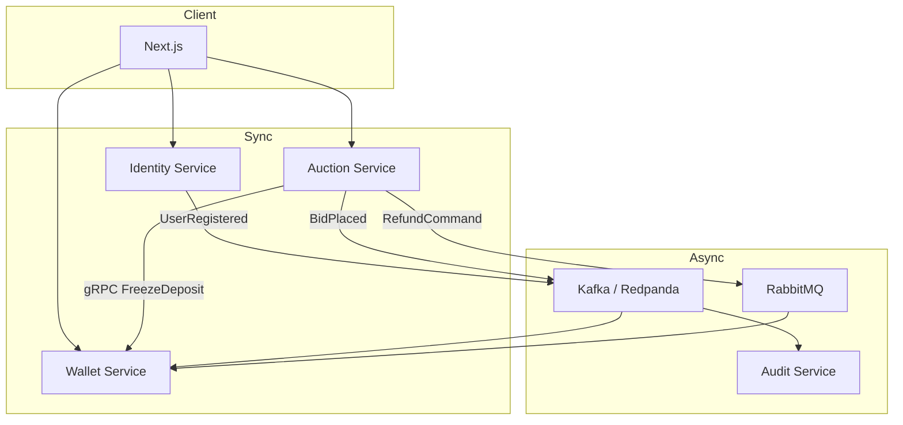

# OmniBid — Architectural Review

> Cập nhật ngày 20/08/2026 sau đợt hardening Flyway, transactional outbox, automatic auction ending và Testcontainers. Lệnh chạy chi tiết nằm trong [README.md](README.md); schema/roadmap mở rộng nằm trong [Phase 4 Design](docs/PHASE_4_IDENTITY_AND_MARKETPLACE_DESIGN.md).

## 1. Project giải quyết bài toán gì?

OmniBid là sàn đấu giá near real-time được xây như một distributed systems lab thay vì một ứng dụng CRUD đơn giản. Hệ thống mô phỏng nhiều tài khoản cùng đặt giá vào một sản phẩm, khóa tiền cọc, lưu audit bất đồng bộ và hoàn cọc cho người thua.

Các chủ đề nổi bật để trình bày trong CV:

- Race condition và contention trên cùng aggregate auction.
- Redis/Redisson distributed lock kết hợp JPA optimistic lock.
- PostgreSQL pessimistic row lock cho mutation số dư.
- gRPC cho quyết định đồng bộ cần phản hồi tức thời.
- Kafka cho event stream/audit và RabbitMQ cho work queue/retry/DLQ.
- Idempotency nhiều lớp: HTTP, gRPC, Kafka consumer, RabbitMQ consumer và unique constraint.
- Transactional outbox để đóng failure window giữa auction database và Kafka/RabbitMQ.
- Testcontainers kiểm chứng migration/constraint trên PostgreSQL và mutual exclusion trên Redis thật.
- Authentication bằng Google OIDC, JWT RS256, rotating refresh session và RBAC.
- Polyglot persistence với PostgreSQL, MongoDB và Redis.

Frontend polling mỗi 1,5 giây nên tên gọi chính xác hiện tại là near real-time. SSE/WebSocket là milestone tiếp theo.

Deployment hiện tách frontend Next.js trên Vercel khỏi backend single-host Docker Compose. Bốn Java service dùng multi-stage/non-root image; Caddy edge profile cung cấp HTTPS cho ba public API subdomain, còn database/broker chỉ bind localhost.

## 2. Bounded context và data ownership

| Service | Dữ liệu sở hữu | Trách nhiệm |
|---|---|---|
| Identity | user, provider identity, profile, role, auth session, auth event | Google login, local lab accounts, ký JWT, rotate/revoke session |
| Auction | auction, bid, winner, current price | validate bid, concurrency control, end auction, phát event/command |
| Wallet | wallet, frozen balance, wallet transaction | top-up/withdraw demo, freeze/refund, financial idempotency |
| Audit | bid audit log | consume Kafka và lưu history phục vụ truy vết/phân tích |

PostgreSQL dùng chung một container local nhưng mỗi service dùng database riêng: `identity_db`, `auction_db`, `wallet_db`. Không tạo foreign key xuyên database/service; UUID user ở auction/wallet là external reference.



## 3. Security model

### Access token và session

- Identity service ký JWT bằng RS256 và publish public key qua `/.well-known/jwks.json`.
- Access token sống 10 phút, giữ trong memory của frontend; không nằm trong `localStorage`.
- Refresh token là chuỗi opaque 256-bit trong HttpOnly/SameSite cookie.
- PostgreSQL chỉ lưu SHA-256 của refresh token, không lưu plaintext.
- Mỗi refresh tạo session/token mới, session cũ chuyển thành `ROTATED`.
- Nếu token đã rotate bị dùng lại, cả token family bị revoke.
- Auction/wallet tự verify `iss`, `aud`, signature, expiration và map claim `roles` thành authority.

Resource service không lưu session theo từng user trong RAM. Chi phí RAM chỉ gồm public key/JWK cache và object xử lý request ngắn hạn; durable session nằm ở PostgreSQL.

### Ownership

Bid body chỉ chứa `bidAmount`. Wallet API dùng prefix `/api/v1/me/wallet`. Cả hai lấy user ID từ JWT `sub`, ngăn client sửa `userId` để thao tác dữ liệu người khác.

Role hiện có:

- `CUSTOMER`: bid, xem/thay đổi ví của mình, profile và session của mình.
- `ADMIN`: kế thừa quyền sử dụng hệ thống và được phép kết thúc auction.

Google role không được tin cậy; role luôn được đọc từ Identity DB. Google identity được định danh bằng `(provider=GOOGLE, provider_subject=sub)`, không dùng email làm khóa bền vững và không tự link chỉ vì email trùng.

## 4. Correctness của luồng bid

```text
POST /api/v1/auctions/{id}/bid
Authorization: Bearer <JWT>
X-Idempotency-Key: <UUID>
{ "bidAmount": 180 }
```

Thứ tự xử lý:

1. Spring Security verify JWT và role.
2. Controller lấy `userId = UUID.fromString(jwt.subject)`.
3. Kiểm tra idempotency key bền vững ở bảng bid.
4. `tryLock(lock:auction:{id}, wait=3s)`; Redisson watchdog gia hạn lease trong lúc current thread giữ lock.
5. Sau khi giữ lock, đọc lại auction và validate `ACTIVE`, thời gian, `currentPrice + stepPrice`.
6. Gọi gRPC `FreezeDeposit` với deadline và operation key ổn định.
7. Wallet lock row, kiểm tra available balance, tăng frozen balance và ghi unique transaction.
8. Auction cập nhật current price/winner, insert bid và outbox row trong cùng PostgreSQL transaction.
9. Sau commit, cập nhật Redis price cache theo best-effort; cache lỗi không đảo ngược bid đã commit.
10. Scheduled outbox publisher chờ Kafka acknowledgement rồi mới đánh dấu event published; Audit consumer dùng `bidId` làm Mongo `_id`.
11. `finally` chỉ unlock khi current thread còn sở hữu lock.

Redis lock giảm contention và serialize toàn cluster; watchdog tránh lock hết lease giữa critical section. Optimistic version, unique idempotency key và database transaction vẫn là correctness guard nếu một writer bỏ qua Redis hoặc request được retry.

## 5. Messaging semantics

### Kafka

- `identity-events`: Identity outbox publisher phát `UserRegistered`; Wallet tạo wallet idempotently theo unique `user_id`.
- `bid-events`: Auction phát `BidPlacedEvent`; Audit consumer ghi MongoDB.
- Producer bật idempotence/`acks=all`; consumer vẫn phải chịu được at-least-once delivery.

Identity và Auction đều có outbox table/publisher. Auction dùng `FOR UPDATE SKIP LOCKED`, broker acknowledgement và trạng thái pending/published để hỗ trợ nhiều instance cùng poll với delivery at-least-once. Audit vẫn idempotent theo `bidId`, còn wallet refund idempotent theo `transactionId`.

### RabbitMQ refund

- Exchange `auction.exchange`, routing key `auction.refund`.
- Queue `wallet.refund.queue` có retry; lỗi cuối cùng đi vào `wallet.refund.dlq`.
- Redis `SET NX idempotent:refund:{transactionId}` là fast dedupe.
- Unique wallet transaction ở PostgreSQL là durable safety net khi Redis mất dữ liệu.
- Refund command được ghi vào auction outbox trong cùng transaction kết thúc phiên; Rabbit publisher confirm quyết định khi nào outbox row được đánh dấu published.

Auction scheduler quét tối đa 100 phiên `ACTIVE` đã qua `endTime` mỗi lượt. Nó gọi lại cùng `endAuction()` có Redisson lock và deterministic refund transaction ID, nên API thủ công và scheduler không tạo hai khoản hoàn tiền.

## 6. Wallet semantics

Mô hình hiện tại:

```text
availableBalance = balance - frozenBalance
```

- Top-up tăng `balance`.
- Withdraw giảm `balance` sau khi kiểm tra available balance.
- Freeze chỉ tăng `frozenBalance`.
- Refund chỉ giảm `frozenBalance`; không cộng lại balance vì tiền chưa từng bị trừ khỏi tổng balance.

Mọi mutation dùng `BigDecimal`/`NUMERIC`, row lock và immutable-ish transaction history. Đây chưa phải double-entry ledger; không nên quảng bá là production fintech ledger.

## 7. Frontend

Next.js 16 App Router + React 19 gồm:

- `/login`: Google One Tap và account local A/B/Admin.
- `/profile`: cập nhật hồ sơ, xem và revoke session.
- `/wallet`: ví của user đăng nhập, nạp/rút demo và transaction history.
- `/auctions/[id]`: countdown, current price, bid form và anonymous bid history.

Axios tự gắn Bearer token, tạo `X-Idempotency-Key` cho command và chỉ thử refresh một lần khi gặp 401. Refresh token không thể đọc từ JavaScript.

Để mô phỏng concurrency, đăng nhập Customer A ở cửa sổ thường và Customer B trong cửa sổ ẩn danh rồi bid cùng auction.

## 8. Database chính

Identity migration quản lý:

```text
users
user_identities
profiles
roles
user_roles
auth_sessions
auth_events
identity_outbox_events
```

Auction domain:

```text
auctions
bids
auction_outbox_events
```

Wallet domain:

```text
wallets
wallet_transactions
```

MongoDB:

```text
bid_logs (compound index auctionId ASC, timestamp DESC)
```

## 9. Kiểm chứng kỹ thuật

Đã chạy trong phiên triển khai hiện tại:

| Kiểm tra | Kết quả |
|---|---|
| Maven reactor | 6/6 module `verify` thành công bằng JDK 21 |
| Backend tests | 26 pass: identity 8, auction 10, wallet 7, audit 1 |
| Testcontainers | PostgreSQL 16 auction/wallet migrations + Redis 7.4 contention 20 luồng |
| Identity security tests | hash-only refresh, rotation, reuse revokes family |
| Frontend typecheck | Pass |
| Next production build | Pass với 6 route |
| Docker infrastructure | PostgreSQL/Mongo/Redis/Rabbit/Redpanda/LocalStack healthy |
| Deployment config | Compose parse pass; 4 backend images + health dependencies + optional Caddy edge |

`mvn clean verify` đã chạy thành công trên Windows/OneDrive bằng JDK 21. Docker Desktop phải hoạt động vì integration tests tạo PostgreSQL/Redis container tạm.

## 10. Đánh giá Senior Engineer

### Điểm mạnh

- Boundary và data ownership rõ ràng.
- Có nhiều lớp bảo vệ concurrency, không phụ thuộc duy nhất vào Redis lock.
- Demo đúng sự khác nhau giữa synchronous RPC và asynchronous messaging.
- Idempotency được giải quyết ở cả transport lẫn database.
- Identity có session lifecycle thực tế hơn JWT tự phát đơn giản.
- UI cho phép reviewer tự tái tạo tình huống hai user cạnh tranh.

### Khoảng trống trước production

1. Freeze thành công nhưng auction commit lỗi cần saga/compensating action và reconciliation.
2. Wallet cần double-entry ledger, winner settlement, reconciliation và audit tài chính.
3. Signing key local sinh lại khi restart; production cần KMS/Vault, persistent keys và rotation.
4. Cần CSRF/origin hardening đầy đủ, rate limiting, account-link flow, MFA cho admin và secret manager.
5. Cần load test concurrent bid, broker redelivery test và failure injection cho Redis/broker/network partition.
6. Cần OpenTelemetry, correlation ID, outbox backlog metrics, dashboards, alerts và centralized logging.
7. Scheduled outbox polling phù hợp portfolio; production scale lớn nên dùng backoff/poison quarantine và cân nhắc CDC.
8. Cần API Gateway, TLS/mTLS và deployment manifests.
9. Product/catalog/S3 media/admin lifecycle/history đầy đủ mới ở design, chưa hoàn tất implementation.

## 11. Roadmap phù hợp cho CV

Thứ tự nên làm tiếp:

1. Product/catalog + admin auction lifecycle + S3 presigned upload.
2. User bid/win/purchase history và settlement người thắng.
3. k6/Gatling test 100–1.000 concurrent bid và broker failure injection.
4. SSE/WebSocket fan-out qua Redis/Kafka.
5. OpenTelemetry + Prometheus/Grafana, gồm outbox backlog/oldest-event alert.
6. Double-entry ledger + reconciliation và winner settlement saga.
7. Debezium CDC nếu polling outbox trở thành bottleneck.
8. API Gateway, rate limit, mTLS và deployment pipeline.

## 12. Mô tả dùng cho CV

### Tiếng Việt

> Xây dựng OmniBid, sàn đấu giá near real-time dạng microservices bằng Java 21/Spring Boot và Next.js. Thiết kế Redis distributed lock kết hợp optimistic/pessimistic database locking để xử lý concurrent bids; gRPC cho freeze deposit; Kafka/RabbitMQ cho audit/refund với idempotent consumers và DLQ. Triển khai Google OIDC, JWT RS256, rotating refresh sessions, RBAC và ownership-safe personal wallet APIs.

### English

> Built OmniBid, a near-real-time auction microservices platform using Java 21, Spring Boot, and Next.js. Designed Redis distributed locking with optimistic/pessimistic database guards for concurrent bidding, gRPC-based deposit reservation, and Kafka/RabbitMQ event workflows with idempotent consumers and DLQ handling. Implemented Google OIDC, RS256 JWTs, rotating refresh sessions, RBAC, and ownership-safe personal wallet APIs.

Khi phỏng vấn, nên trình bày rõ các failure window còn tồn tại và kế hoạch outbox/saga; đó là tín hiệu thiết kế hệ thống tốt hơn việc gọi boilerplate là “production-ready”.
