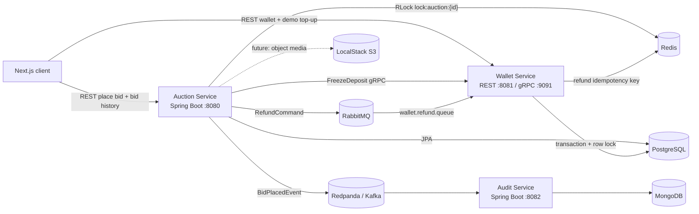
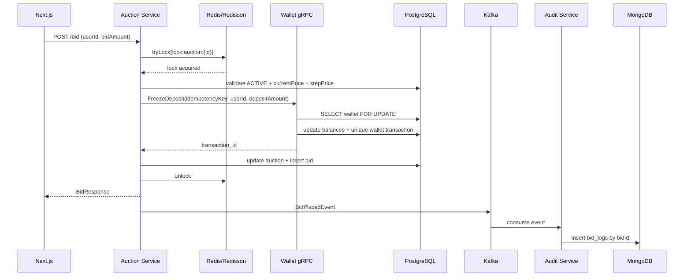
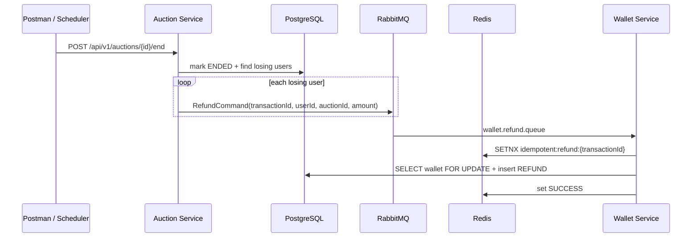

# OmniBid

OmniBid là monorepo thực hành xây dựng sàn đấu giá gần real-time, tập trung vào các bài toán thường gặp trong distributed systems: concurrent bid, distributed lock, giao dịch số dư, idempotency và event-driven processing.

> Đây là portfolio/learning project. Những phần liên quan đến tiền thật cần thêm security, ledger kế toán kép, reconciliation, observability và quy trình vận hành trước khi dùng trong production.

## Kiến trúc



Luồng đặt giá:



Luồng kết thúc phiên và hoàn cọc:



## Tech stack

| Thành phần | Công nghệ |
|---|---|
| Auction | Java 21, Spring Boot 3.3, JPA, PostgreSQL, Redisson, Redis, gRPC client, Kafka producer |
| Wallet | Java 21, Spring Boot 3.3, JPA, PostgreSQL, gRPC server, RabbitMQ, Redis |
| Audit | Java 21, Spring Boot 3.3, Kafka consumer, Spring Data MongoDB |
| Frontend | Next.js 16 App Router, React 19, TypeScript, TailwindCSS, Axios |
| Infrastructure | Docker Compose, PostgreSQL, MongoDB, Redis, RabbitMQ, Redpanda, LocalStack |

## Cấu trúc thư mục

```text
OmniBid/
├── contracts/wallet-proto/       # nguồn sự thật duy nhất cho gRPC contract
├── services/
│   ├── auction-service/          # bid command + Redisson distributed lock
│   ├── wallet-service/           # freeze/refund + transactional balance
│   └── audit-service/            # Kafka -> MongoDB bid_logs
├── frontend/src/                 # Next.js App Router client, services, types, UI
├── infrastructure/postgres/      # tạo auction_db và wallet_db
├── docker-compose.yml
├── pom.xml                       # Maven reactor/aggregator
└── README.md
```

## Yêu cầu local

- JDK 21 trở lên; Maven compiler được khóa ở Java release 21.
- Maven 3.9+.
- Node.js 20+ và npm.
- Docker Desktop với Compose v2.
- Git; GitHub CLI (`gh`) là tùy chọn cho bước tạo repository.

## Chạy local

### 1. Clone và cấu hình

```powershell
git clone <YOUR_REPOSITORY_URL> OmniBid
Set-Location OmniBid
Copy-Item .env.example .env
```

### 2. Bật infrastructure

```powershell
docker compose up -d
docker compose ps
```

Các endpoint mặc định:

- PostgreSQL: `localhost:5432` — user/password `omnibid`.
- MongoDB: `localhost:27017`.
- Redis: `localhost:6379`.
- Kafka API: `localhost:9092`.
- RabbitMQ: `localhost:5672`; management UI `http://localhost:15672`.
- LocalStack: `http://localhost:4566`.

Nếu volume PostgreSQL đã được tạo trước khi có `init.sql`, hãy chủ động tạo `auction_db` và `wallet_db`. Chỉ dùng `docker compose down -v` khi chắc chắn có thể xóa toàn bộ dữ liệu local.

Nếu máy đã có PostgreSQL local chiếm IPv4 port `5432` trong khi Docker Desktop publish cùng port qua IPv6, Java có thể kết nối nhầm database. Hãy dừng PostgreSQL local hoặc override khi chạy service:

```powershell
$env:WALLET_DB_URL = "jdbc:postgresql://[::1]:5432/wallet_db"
$env:AUCTION_DB_URL = "jdbc:postgresql://[::1]:5432/auction_db"
```

### 3. Build backend

Từ root monorepo:

```powershell
mvn clean verify
```

Sau đó mở ba terminal riêng:

```powershell
Set-Location services/wallet-service
mvn spring-boot:run
```

```powershell
Set-Location services/auction-service
mvn spring-boot:run
```

```powershell
Set-Location services/audit-service
mvn spring-boot:run
```

Thứ tự khuyến nghị là wallet trước auction để gRPC target `localhost:9091` đã sẵn sàng.

### 4. Chạy frontend

```powershell
Set-Location frontend
Copy-Item .env.example .env.local
npm install
npm run dev
```

Nếu PowerShell chặn `npm.ps1`, dùng trực tiếp:

```powershell
npm.cmd install
npm.cmd run dev
```

Mở `http://localhost:3000`. Trang chi tiết refresh auction và bid history mỗi `1.5` giây; trang danh sách và wallet refresh mỗi `3` giây. Có thể thay polling bằng SSE/WebSocket trong phase tiếp theo.

Các biến frontend mặc định khi chạy service trực tiếp bằng Maven:

```dotenv
NEXT_PUBLIC_AUCTION_API_URL=http://localhost:8080
NEXT_PUBLIC_WALLET_API_URL=http://localhost:8081
```

Nếu dùng các app container local của project, đặt lần lượt là `http://localhost:28080` và `http://localhost:28081`.

Frontend Phase 3 gồm:

- `src/services/api.ts`: hai Axios instance và interceptor tự sinh `X-Idempotency-Key` cho bid/payment/top-up.
- `src/services/auctionService.ts`: list/detail/place bid/bid history.
- `/auctions/{id}`: countdown, giá real-time, bid form, anonymous history.
- `/wallet`: available/frozen balance và top-up demo idempotent.

## API demo

Project seed sẵn:

- Auction ID: `11111111-1111-1111-1111-111111111111`.
- Phase 2 auction ID: `44444444-4444-4444-4444-444444444444`.
- Bidder/wallet IDs: `22222222-2222-2222-2222-222222222222` và `33333333-3333-3333-3333-333333333333`.
- Số dư ví ban đầu: `1,000,000.00`.

Đặt một bid bằng PowerShell:

```powershell
$body = @{
  userId = "22222222-2222-2222-2222-222222222222"
  bidAmount = 180.00
} | ConvertTo-Json

Invoke-RestMethod `
  -Method Post `
  -Uri "http://localhost:8080/api/v1/auctions/11111111-1111-1111-1111-111111111111/bid" `
  -Headers @{ "X-Idempotency-Key" = [guid]::NewGuid().ToString() } `
  -ContentType "application/json" `
  -Body $body
```

Bid lưu chính `X-Idempotency-Key` vào unique index của bảng `bids`; wallet vẫn dùng khóa `deposit:{auctionId}:{userId}`, vì vậy cùng một user đặt nhiều bid trong một phiên chỉ bị freeze deposit một lần.

Các API frontend bổ sung:

```http
GET  /api/v1/auctions/{auctionId}/bids
GET  /api/v1/wallets/{userId}
POST /api/v1/wallets/{userId}/top-up
```

### Test PHASE 2 bằng Postman

Nếu đang chạy các app container theo hướng dẫn của Codex, dùng `baseUrl = http://localhost:28080`. Nếu chạy `auction-service` trực tiếp bằng Maven, dùng port `8080`.

Tạo Postman environment:

```text
baseUrl    = http://localhost:28080
auctionId  = 44444444-4444-4444-4444-444444444444
loserId    = 33333333-3333-3333-3333-333333333333
winnerId   = 22222222-2222-2222-2222-222222222222
```

1. Bid `110.00` cho user sẽ thua:

```http
POST {{baseUrl}}/api/v1/auctions/{{auctionId}}/bid
Content-Type: application/json

{
  "userId": "{{loserId}}",
  "bidAmount": 110.00
}
```

2. Bid `120.00` cho user thắng:

```http
POST {{baseUrl}}/api/v1/auctions/{{auctionId}}/bid
Content-Type: application/json

{
  "userId": "{{winnerId}}",
  "bidAmount": 120.00
}
```

3. Kết thúc phiên:

```http
POST {{baseUrl}}/api/v1/auctions/{{auctionId}}/end
```

Response trả `status = ENDED`, `winningUserId` và `refundCommandsPublished`. Gọi lại endpoint này là an toàn: command dùng cùng `transactionId`, Redis và unique index PostgreSQL sẽ chặn refund trùng.

4. Kiểm tra audit log trong MongoDB:

```powershell
docker exec omnibid-mongodb mongosh omnibid_audit --quiet --eval `
  'printjson(db.bid_logs.find().sort({timestamp:-1}).limit(10).toArray())'
```

5. Kiểm tra ví và durable refund transaction trong PostgreSQL:

```powershell
docker exec omnibid-postgres psql -U omnibid -d wallet_db -c `
  "select user_id, balance, frozen_balance, balance-frozen_balance as available_balance from wallets order by user_id;"

docker exec omnibid-postgres psql -U omnibid -d wallet_db -c `
  "select wallet_id, auction_id, amount, type, status, idempotency_key from wallet_transactions order by created_at desc;"
```

Sau refund, `balance` tổng không đổi; `frozen_balance` của bidder thua giảm và `available_balance` tăng lại. Kiểm tra RabbitMQ tại `http://localhost:15672`: queue chính là `wallet.refund.queue`, queue lỗi là `wallet.refund.dlq`.

## Các invariant và quyết định thiết kế

1. Mỗi auction chỉ có một bid được đánh giá tại một thời điểm trên toàn cluster nhờ `lock:auction:{auctionId}`.
2. Giá hiện tại luôn được đọc lại sau khi lấy lock; kiểm tra trước lock không đủ để chống race condition.
3. Lock có wait time 3 giây và lease time 5 giây; `finally` chỉ unlock nếu current thread vẫn sở hữu lock.
4. Wallet dùng `SELECT ... FOR UPDATE` và transaction để serialize thay đổi số dư. Tiền dùng `BigDecimal`/PostgreSQL `NUMERIC`, không dùng floating point.
5. gRPC `idempotency_key` được lưu unique ở `wallet_transactions`; deposit chỉ active một lần cho mỗi user/auction.
6. Refund có fast dedupe bằng Redis `SETNX` và durable dedupe trong PostgreSQL.
7. Audit consumer dùng Kafka `bidId` làm Mongo `_id`, vì vậy event redelivery không tạo log trùng.
8. Endpoint `/end` có thể gọi lại để republish command sau lỗi mạng; wallet dedupe theo freeze `transactionId` ở cả Redis và PostgreSQL.

### Giới hạn có chủ đích của boilerplate

- Lưu bid và publish Kafka đang là dual-write. Nếu process chết sau DB commit nhưng trước Kafka publish, audit có thể thiếu event. Bước production tiếp theo là **Transactional Outbox + CDC/Debezium**.
- Freeze wallet xảy ra trước khi auction transaction commit. Cần saga/compensating refund và reconciliation job để xử lý lỗi giữa hai service.
- Distributed lock hỗ trợ giảm contention nhưng database constraints, optimistic version và idempotency vẫn là lớp bảo vệ tính đúng đắn.
- Demo chưa có authentication/authorization, rate limiting, TLS/mTLS, secret manager, tracing, metrics dashboard hay double-entry ledger.
- Frontend hiện dùng polling 1.5 giây ở trang chi tiết. SSE hoặc WebSocket kết hợp pub/sub sẽ phù hợp hơn khi cần fan-out real-time giữa nhiều instance.

## Chuỗi lệnh tạo repository và push GitHub lần đầu

Từ thư mục chứa project:

```powershell
Set-Location C:\Users\FPT\OneDrive\Documents\Code\OmniBid
git init -b main
git add .
git status
git commit -m "feat: bootstrap OmniBid distributed auction monorepo"
```

Cách nhanh nhất khi đã cài và đăng nhập GitHub CLI:

```powershell
gh auth login
gh repo create OmniBid --public --source . --remote origin --push
git status
```

Hoặc tạo repository rỗng tên `OmniBid` trên GitHub, không chọn README/.gitignore/license, rồi chạy:

```powershell
git remote add origin https://github.com/<YOUR_USERNAME>/OmniBid.git
git push -u origin main
git remote -v
git status
```

Không commit `.env`, access token hoặc password thật. Trước khi push, luôn kiểm tra `git diff --cached` và có thể dùng secret scanner trong CI.

## Hướng phát triển phù hợp cho CV

- Transactional Outbox và Debezium/Kafka Connect.
- SSE/WebSocket fan-out qua Redis Pub/Sub hoặc Kafka.
- Testcontainers integration test, Gatling/k6 concurrency test và chaos test khi Redis leader failover.
- OpenTelemetry trace xuyên REST → Redisson → gRPC → Kafka.
- Prometheus/Grafana dashboard cho lock wait time, bid rejection rate, consumer lag và DLQ depth.
- Keycloak/OIDC, API gateway, rate limiting, mTLS nội bộ và Vault/secret manager.
- Double-entry ledger, reconciliation job và immutable financial journal cho wallet.
