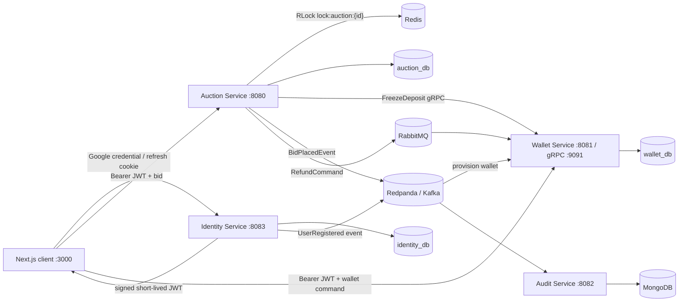
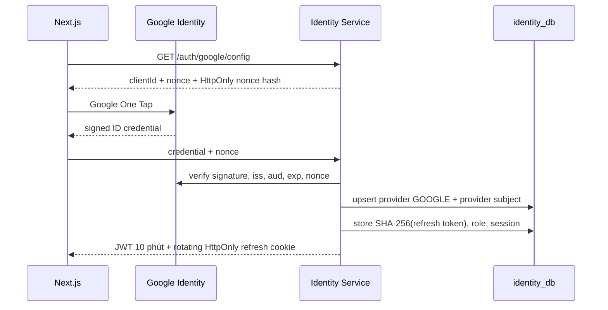
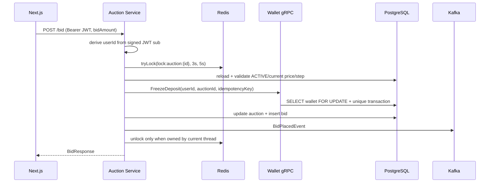

# OmniBid

[](https://github.com/okuminhphen/omnibid/actions/workflows/ci.yml)
[](https://openjdk.org/projects/jdk/21/)
[](https://spring.io/projects/spring-boot)
[](https://nextjs.org/)
[](https://www.typescriptlang.org/)
[](docker-compose.yml)
[](https://redpanda.com/)
[](https://www.rabbitmq.com/)
[](https://redis.io/)
[](https://www.postgresql.org/)
[](https://www.mongodb.com/)
[](PROJECT_OVERVIEW.md)
[](LICENSE)

OmniBid là monorepo sàn đấu giá gần real-time phục vụ học tập và portfolio Backend/Middle Developer. Project tập trung vào tính đúng đắn khi nhiều người cùng đặt giá, giao tiếp đồng bộ/bất đồng bộ giữa microservice, idempotency tài chính và authentication theo chuẩn OIDC.

> Đây là portfolio/learning project. Ví chỉ mô phỏng tiền nội bộ; chưa kết nối ngân hàng hay xử lý tiền thật.

Tài liệu chi tiết:

- [PROJECT_OVERVIEW.md](PROJECT_OVERVIEW.md): phân tích hệ thống, luồng dữ liệu và giới hạn hiện tại.
- [PHASE_4_IDENTITY_AND_MARKETPLACE_DESIGN.md](docs/PHASE_4_IDENTITY_AND_MARKETPLACE_DESIGN.md): thiết kế schema user/session, RBAC, Google One Tap và roadmap marketplace.
- [GITHUB_RELEASE_GUIDE.md](docs/GITHUB_RELEASE_GUIDE.md): quy trình push `develop`, mở PR, release `v1.0.0` và metadata GitHub.

## Kiến trúc



### Luồng đăng nhập



Google `sub` là external identity ổn định; email không được dùng để tự động link account. Role chỉ lấy từ `identity_db`, không tin role do client hoặc Google gửi lên.

### Luồng đặt giá



## Chức năng hiện có

- Tài khoản riêng với Google One Tap hoặc ba account local dành cho concurrency lab.
- Access token RS256 sống ngắn; refresh token opaque trong HttpOnly cookie, chỉ lưu hash và rotate sau mỗi lần dùng.
- Phát hiện reuse refresh token và revoke toàn bộ token family.
- RBAC `CUSTOMER`/`ADMIN`; auction và wallet không nhận `userId` từ request body của customer.
- Quản lý hồ sơ và thu hồi từng/all login session.
- Ví cá nhân: nạp/rút tiền demo, available/frozen balance và lịch sử giao dịch idempotent.
- Đặt giá qua Redis distributed lock, freeze deposit qua gRPC và optimistic lock dự phòng.
- Kafka audit log vào MongoDB; RabbitMQ refund có retry, DLQ, Redis fast dedupe và PostgreSQL durable dedupe.
- UI polling gần real-time; có thể mở cửa sổ thường + ẩn danh để đấu giá bằng hai user khác nhau.

Admin hiện có authority riêng và quyền kết thúc phiên. CRUD catalog/product và màn hình quản trị đầy đủ là milestone tiếp theo trong tài liệu Phase 4, không được mô tả nhầm là đã hoàn tất.

## Tech stack

| Thành phần | Công nghệ |
|---|---|
| Identity | Java 21, Spring Boot 3.3, Spring Security, OAuth2 Resource Server, Nimbus JOSE JWT, JPA, Flyway, PostgreSQL |
| Auction | Java 21, Spring Boot, JPA, PostgreSQL, Redisson/Redis, gRPC client, Kafka producer, RabbitMQ publisher |
| Wallet | Java 21, Spring Boot, JPA, PostgreSQL row lock, gRPC server, Kafka consumer, RabbitMQ consumer, Redis |
| Audit | Java 21, Spring Boot, Kafka consumer, Spring Data MongoDB |
| Frontend | Next.js 16 App Router, React 19, TypeScript, Tailwind CSS, Axios, Google Identity Services |
| Infrastructure | Docker Compose, PostgreSQL 16, MongoDB 7, Redis 7.4, RabbitMQ 3.13, Redpanda, LocalStack |

## Cấu trúc monorepo

```text
OmniBid/
├── contracts/wallet-proto/          # nguồn sự thật duy nhất cho gRPC contract
├── services/
│   ├── identity-service/            # user/profile/RBAC/session/JWT/JWK
│   ├── auction-service/             # auction/bid/Redis lock/event publisher
│   ├── wallet-service/              # freeze/refund/top-up/withdraw/idempotency
│   └── audit-service/               # Kafka -> MongoDB bid_logs
├── frontend/src/
│   ├── app/login/                   # Google One Tap + local concurrency users
│   ├── app/profile/                 # profile + session management
│   ├── app/wallet/                  # personal wallet dashboard
│   └── app/auctions/[id]/           # real-time bid screen
├── infrastructure/postgres/init.sql # tạo identity/auction/wallet databases
├── docs/
├── docker-compose.yml
└── pom.xml                          # Maven reactor gồm 6 modules
```

## Yêu cầu local

- JDK 21 (project khóa Maven compiler release 21).
- Maven 3.9+.
- Node.js 20+ và npm.
- Docker Desktop với Compose v2.

## Chạy local

### 1. Cấu hình

```powershell
git clone https://github.com/okuminhphen/omnibid.git OmniBid
Set-Location OmniBid
Copy-Item .env.example .env
```

`.env` không được commit. Credential trong file mẫu chỉ dành cho local.

### 2. Bật infrastructure

```powershell
docker compose up -d
docker compose ps
```

Endpoint hạ tầng:

| Thành phần | URL/port |
|---|---|
| PostgreSQL | `localhost:5432` |
| MongoDB | `localhost:27017` |
| Redis | `localhost:6379` |
| Kafka | `localhost:9092` |
| RabbitMQ broker | `localhost:5672` |
| RabbitMQ Management | `http://localhost:15672` |
| LocalStack | `http://localhost:4566` |

`init.sql` chỉ chạy lần đầu khi volume PostgreSQL rỗng. Nếu giữ volume từ phiên bản cũ, tạo database còn thiếu mà không xóa dữ liệu:

```powershell
docker exec omnibid-postgres psql -U omnibid -d postgres -c "CREATE DATABASE identity_db"
```

Nếu database đã tồn tại, PostgreSQL sẽ báo lỗi `already exists` và không cần làm gì thêm. Không dùng `docker compose down -v` nếu muốn giữ dữ liệu local.

### 3. Build và test backend

```powershell
$env:JAVA_HOME = "C:\Program Files\Java\jdk-21"
$env:Path = "$env:JAVA_HOME\bin;$env:Path"
mvn verify
```

Trên thư mục đồng bộ OneDrive, `mvn clean` đôi khi bị file watcher giữ thư mục Protobuf tạm. `mvn verify` vẫn build/test đầy đủ mà không cần xóa target trước.

### 4. Chạy backend

Mở bốn terminal riêng, theo thứ tự sau:

```powershell
mvn -pl services/identity-service spring-boot:run
```

```powershell
mvn -pl services/wallet-service spring-boot:run
```

```powershell
mvn -pl services/auction-service spring-boot:run
```

```powershell
mvn -pl services/audit-service spring-boot:run
```

Port mặc định:

- Identity REST/JWK: `http://localhost:8083`.
- Auction REST: `http://localhost:8080`.
- Wallet REST: `http://localhost:8081`; gRPC `localhost:9091`.
- Audit consumer: không expose HTTP ở module hiện tại; xác minh bằng log `Started AuditServiceApplication` và Kafka subscription.

Nếu port `8080` bị phần mềm khác chiếm, có thể chạy application ports `28080/28081/28082/28083`. Khi đó issuer và JWK URL phải thống nhất giữa các service; xem `.env.local` để cấu hình frontend tương ứng.

### 5. Chạy frontend

```powershell
Set-Location frontend
Copy-Item .env.example .env.local
npm install
npm run dev
```

`frontend/.env.local`:

```dotenv
NEXT_PUBLIC_AUCTION_API_URL=http://localhost:8080
NEXT_PUBLIC_WALLET_API_URL=http://localhost:8081
NEXT_PUBLIC_IDENTITY_API_URL=http://localhost:8083
```

Mở `http://localhost:3000`.

## Google One Tap

Local chạy được ngay bằng account dev mà không cần Google credential. Để bật Google thật:

1. Tạo OAuth 2.0 Web Client trong Google Cloud Console.
2. Thêm `http://localhost:3000` vào Authorized JavaScript origins.
3. Khi chạy bằng Maven, đặt biến môi trường cho terminal identity-service:

```powershell
$env:GOOGLE_AUTH_ENABLED = "true"
$env:GOOGLE_CLIENT_ID = "<your-web-client-id>"
mvn -pl services/identity-service spring-boot:run
```

Nếu deploy bằng container/orchestrator, truyền hai biến cùng tên vào container. File `.env` ở root được Docker Compose dùng để nội suy, Maven không tự động import file này.

Backend luôn verify signature, issuer, audience, expiration và nonce của Google credential. Không đưa Google client secret vào frontend; One Tap web flow dùng public client ID.

## Test nhiều người đấu giá

Project có ba account chỉ bật ở Spring profile `local`:

| Alias | User ID | Role |
|---|---|---|
| `customer-a` | `22222222-2222-2222-2222-222222222222` | CUSTOMER |
| `customer-b` | `33333333-3333-3333-3333-333333333333` | CUSTOMER |
| `admin` | `99999999-9999-9999-9999-999999999999` | ADMIN |

1. Mở `http://localhost:3000/login` ở cửa sổ thường, chọn Customer A.
2. Mở cửa sổ ẩn danh, chọn Customer B.
3. Nạp tiền demo ở `/wallet` cho cả hai.
4. Mở cùng auction và đặt giá gần như đồng thời.
5. Quan sát chỉ một request tại một thời điểm đi qua `lock:auction:{auctionId}`; request còn lại đọc giá mới trước khi validate.

### Test API bằng PowerShell

```powershell
$loginBody = @{ alias = "customer-a" } | ConvertTo-Json
$login = Invoke-RestMethod `
  -Method Post `
  -Uri "http://localhost:8083/api/v1/auth/dev/login" `
  -SessionVariable authSession `
  -ContentType "application/json" `
  -Body $loginBody

$headers = @{
  Authorization = "Bearer $($login.accessToken)"
  "X-Idempotency-Key" = [guid]::NewGuid().ToString()
}

Invoke-RestMethod `
  -Method Post `
  -Uri "http://localhost:8081/api/v1/me/wallet/top-ups" `
  -Headers $headers `
  -ContentType "application/json" `
  -Body (@{ amount = 500000 } | ConvertTo-Json)

Invoke-RestMethod `
  -Method Post `
  -Uri "http://localhost:8080/api/v1/auctions/11111111-1111-1111-1111-111111111111/bid" `
  -Headers $headers `
  -ContentType "application/json" `
  -Body (@{ bidAmount = 180 } | ConvertTo-Json)
```

Lưu ý: bid request không có `userId`; backend lấy user từ JWT `sub`.

## API chính

```text
POST   /api/v1/auth/google
POST   /api/v1/auth/dev/login                  # local profile only
POST   /api/v1/auth/refresh
POST   /api/v1/auth/logout
GET    /api/v1/me
PATCH  /api/v1/me/profile
GET    /api/v1/me/sessions
DELETE /api/v1/me/sessions/{sessionId}

GET    /api/v1/auctions
GET    /api/v1/auctions/{auctionId}
GET    /api/v1/auctions/{auctionId}/bids
POST   /api/v1/auctions/{auctionId}/bid        # CUSTOMER or ADMIN
POST   /api/v1/auctions/{auctionId}/end        # ADMIN only

GET    /api/v1/me/wallet
GET    /api/v1/me/wallet/transactions
POST   /api/v1/me/wallet/top-ups
POST   /api/v1/me/wallet/withdrawals
```

## Invariant và quyết định thiết kế

1. Client không được chọn `userId` cho bid/wallet; identity được suy ra từ JWT đã verify.
2. Mỗi auction chỉ có một bid được đánh giá tại một thời điểm trên toàn cluster nhờ Redis lock.
3. Auction luôn được đọc lại sau khi lấy lock; validate trước lock không đủ chống race condition.
4. Wallet dùng `SELECT ... FOR UPDATE`, `BigDecimal/NUMERIC` và unique idempotency key.
5. Cùng user chỉ freeze deposit một lần cho mỗi auction.
6. Refund dùng Redis cho fast dedupe và PostgreSQL unique transaction cho durable dedupe.
7. Audit consumer dùng `bidId` làm Mongo `_id`, nên Kafka redelivery không tạo bản ghi trùng.
8. Refresh token không nằm trong JavaScript/localStorage và không lưu plaintext trong database.
9. JWT access token không tạo một entry RAM cho mỗi user tại resource service; session bền vững nằm ở PostgreSQL.

## Giới hạn và roadmap production

- Bid DB commit và Kafka publish vẫn là dual-write; cần Transactional Outbox + CDC.
- Freeze wallet trước auction commit cần saga/compensation và reconciliation job.
- Ví hiện là balance + immutable transaction history, chưa phải double-entry ledger hoàn chỉnh.
- RSA signing key được sinh khi identity-service khởi động trong local; production phải dùng PEM/KMS/Vault và key rotation.
- Chưa có API Gateway, TLS/mTLS, rate limiting, OpenTelemetry, Prometheus/Grafana và centralized logs.
- UI dùng polling 1.5 giây; milestone tiếp theo là SSE/WebSocket fan-out.
- Product/catalog, ảnh S3, quản trị auction lifecycle và lịch sử thắng/thua đầy đủ nằm trong Phase 4 tiếp theo.

## Kiểm chứng hiện tại

- Maven reactor: wallet proto + identity + auction + wallet + audit.
- Unit tests cover refresh rotation/reuse detection, distributed bid lock path, wallet/refund idempotency và audit document.
- Frontend có `npm run typecheck` và production `npm run build`.

## GitHub

```powershell
git status
git diff
git add .
git commit -m "feat: add identity, RBAC and personal wallet flows"
git push -u origin main
```

Luôn kiểm tra diff và không commit `.env`, token, cookie hoặc secret thật.
