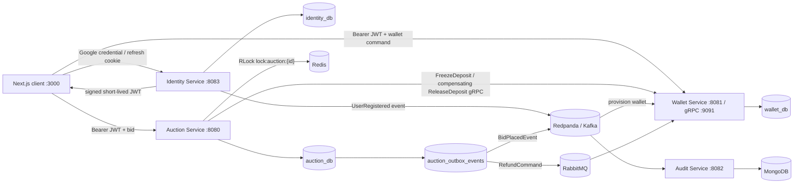
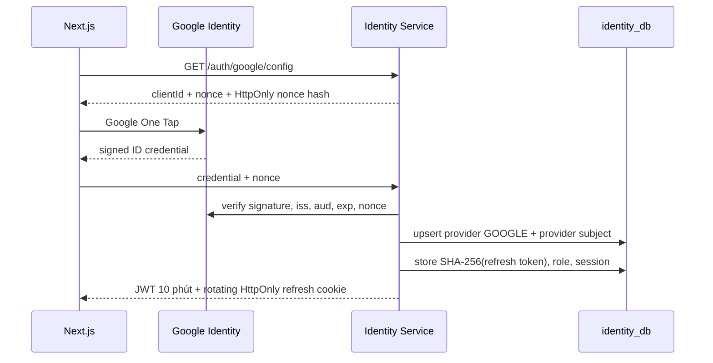
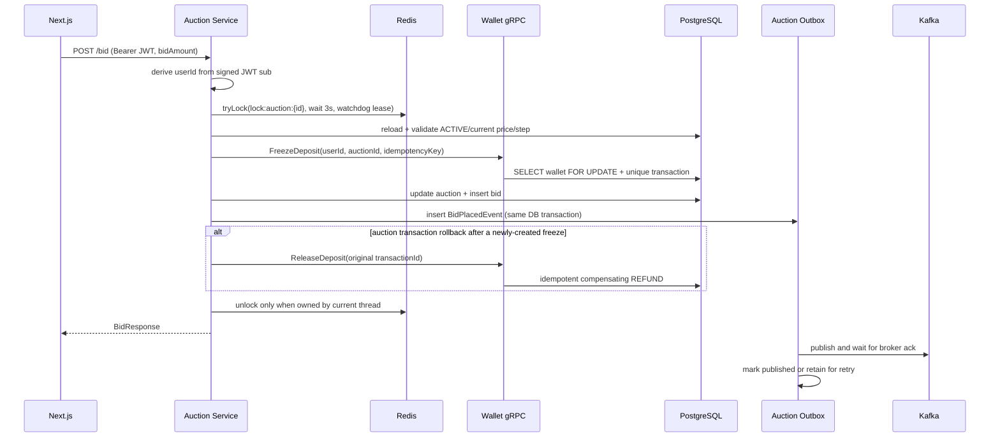

# OmniBid

[](https://github.com/okuminhphen/omnibid/actions/workflows/ci.yml)
[](https://openjdk.org/projects/jdk/21/)
[](https://spring.io/projects/spring-boot)
[](https://nextjs.org/)
[](https://www.typescriptlang.org/)
[](docker-compose.yml)
[](https://redpanda.com/)
[](https://www.rabbitmq.com/)
[](https://redis.io/)
[](https://www.postgresql.org/)
[](https://www.mongodb.com/)
[](PROJECT_OVERVIEW.md)
[](LICENSE)

OmniBid là monorepo sàn đấu giá gần real-time phục vụ học tập và portfolio Backend/Middle Developer. Project tập trung vào tính đúng đắn khi nhiều người cùng đặt giá, giao tiếp đồng bộ/bất đồng bộ giữa microservice, idempotency tài chính và authentication theo chuẩn OIDC.

> Đây là portfolio/learning project. Ví chỉ mô phỏng tiền nội bộ; chưa kết nối ngân hàng hay xử lý tiền thật.

Tài liệu chi tiết:

- [PROJECT_OVERVIEW.md](PROJECT_OVERVIEW.md): phân tích hệ thống, luồng dữ liệu và giới hạn hiện tại.
- [PROJECT_STRUCTURE.md](docs/PROJECT_STRUCTURE.md): cây thư mục, module ownership và điểm bắt đầu khi đọc code.
- [ARCHITECTURE_AND_CODE_QUALITY.md](docs/ARCHITECTURE_AND_CODE_QUALITY.md): use-case/ports-adapters, SOLID rules, domain invariant và failure semantics.
- [DATABASE_SCHEMA.md](docs/DATABASE_SCHEMA.md): ERD, bảng, index và invariant của từng database.
- [PHASE_4_IDENTITY_AND_MARKETPLACE_DESIGN.md](docs/PHASE_4_IDENTITY_AND_MARKETPLACE_DESIGN.md): thiết kế schema user/session, RBAC, Google One Tap và roadmap marketplace.
- [REPOSITORY_AUDIT.md](docs/REPOSITORY_AUDIT.md): kết quả build/test/security hygiene, các sạn đã sửa và giới hạn production còn lại.
- [FRESHER_HARDENING.md](docs/FRESHER_HARDENING.md): Flyway, outbox, lock watchdog, Testcontainers và kịch bản trình bày khi phỏng vấn.
- [GITHUB_RELEASE_GUIDE.md](docs/GITHUB_RELEASE_GUIDE.md): quy trình push `develop`, mở PR, release `v1.0.0` và metadata GitHub.
- [DEPLOYMENT.md](docs/DEPLOYMENT.md): backend Docker Compose/Caddy HTTPS và frontend Vercel.
- [CV_BULLETS.md](docs/CV_BULLETS.md): bullet points Việt/Anh chỉ dùng các số liệu đã kiểm chứng.

## Kiến trúc



### Luồng đăng nhập



Google `sub` là external identity ổn định; email không được dùng để tự động link account thông thường. Ngoại lệ duy nhất là account ADMIN chưa có provider identity được provision từ `OMNIBID_ADMIN_EMAIL`: một Google credential có email trùng khớp và đã verify được phép claim account đó đúng một lần. Role chỉ lấy từ `identity_db`, không tin role do client hoặc Google gửi lên.

### Luồng đặt giá



## Chức năng hiện có

- Google One Tap theo luồng sign-in-or-sign-up: email mới tự tạo account `CUSTOMER`; không có password hay account mock.
- Account `ADMIN` được bootstrap từ environment, lưu trong PostgreSQL và chỉ liên kết với Google identity đã verify.
- Access token RS256 sống ngắn; refresh token opaque trong HttpOnly cookie, chỉ lưu hash và rotate sau mỗi lần dùng.
- Phát hiện reuse refresh token và revoke toàn bộ token family.
- RBAC `CUSTOMER`/`ADMIN`; auction và wallet không nhận `userId` từ request body của customer.
- Admin có API tạo auction `PENDING`, kích hoạt và kết thúc phiên; dữ liệu auction/wallet giả không được tự seed khi service khởi động.
- Quản lý hồ sơ và thu hồi từng/all login session.
- Ví cá nhân: nạp/rút tiền demo, available/frozen balance và lịch sử giao dịch idempotent.
- Đặt giá qua Redis distributed lock, freeze deposit qua gRPC và optimistic lock dự phòng.
- Auction application layer tách query/use case khỏi controller; gRPC, Redis cache và Redisson lock nằm sau outbound ports/adapters.
- Domain `Auction`, `Bid`, `Wallet`, `WalletTransaction` dùng factory/behavior thay vì public setter để giữ invariant.
- Nếu một freeze vừa được tạo nhưng auction transaction rollback, `ReleaseDeposit` chạy như compensating action và vẫn idempotent ở wallet ledger.
- Redisson watchdog tự gia hạn lock để critical section không mất lock khi gRPC/DB chậm hơn lease cố định.
- Auction transactional outbox gắn bid/refund với DB transaction; publisher chỉ đánh dấu hoàn tất sau broker acknowledgement.
- Scheduler tự tìm tối đa 100 phiên `ACTIVE` hết hạn mỗi lượt và chốt qua cùng distributed lock với API thủ công.
- Kafka audit log vào MongoDB; RabbitMQ refund có retry, DLQ, Redis fast dedupe và PostgreSQL durable dedupe.
- Flyway sở hữu schema auction/wallet; Hibernate chạy `validate` thay vì tự sửa database bằng `ddl-auto=update`.
- Bốn backend service có multi-stage Docker build, non-root/read-only runtime, health-gated startup và Caddy HTTPS profile tùy chọn.
- UI polling gần real-time; có thể mở cửa sổ thường + ẩn danh để đấu giá bằng hai user khác nhau.

Admin hiện có authority riêng cho create/activate/end auction. Product/catalog, media và màn hình quản trị đầy đủ vẫn là milestone tiếp theo, không được mô tả nhầm là đã hoàn tất.

## Tech stack

| Thành phần | Công nghệ |
|---|---|
| Identity | Java 21, Spring Boot 3.3, Spring Security, OAuth2 Resource Server, Nimbus JOSE JWT, JPA, Flyway, PostgreSQL |
| Auction | Java 21, Spring Boot, JPA, PostgreSQL, Redisson/Redis, gRPC client, Kafka producer, RabbitMQ publisher |
| Wallet | Java 21, Spring Boot, JPA, PostgreSQL row lock, gRPC server, Kafka consumer, RabbitMQ consumer, Redis |
| Audit | Java 21, Spring Boot, Kafka consumer, Spring Data MongoDB |
| Frontend | Next.js 16 App Router, React 19, TypeScript, Tailwind CSS, Axios, Google Identity Services |
| Infrastructure | Docker Compose, PostgreSQL 16, MongoDB 7, Redis 7.4, RabbitMQ 3.13, Redpanda, LocalStack |

## Cấu trúc monorepo

```text
OmniBid/
├── contracts/wallet-proto/          # nguồn sự thật duy nhất cho gRPC contract
├── services/
│   ├── identity-service/            # user/profile/RBAC/session/JWT/JWK
│   ├── auction-service/             # auction/bid/Redis lock/outbox publisher
│   ├── wallet-service/              # freeze/refund/top-up/withdraw/idempotency
│   └── audit-service/               # Kafka -> MongoDB bid_logs
├── frontend/src/
│   ├── app/login/                   # Google sign-in-or-sign-up
│   ├── app/profile/                 # profile + session management
│   ├── app/wallet/                  # personal wallet dashboard
│   └── app/auctions/[id]/           # real-time bid screen
├── infrastructure/postgres/init.sql # tạo identity/auction/wallet databases
├── deploy/Caddyfile                  # optional public HTTPS edge for a VPS
├── docs/
├── docker-compose.yml
└── pom.xml                          # Maven reactor gồm 6 modules
```

## Yêu cầu local

- JDK 21 (project khóa Maven compiler release 21).
- Maven 3.9+.
- Node.js 20+ và npm.
- Docker Desktop với Compose v2.

## Chạy local

### 1. Cấu hình

```powershell
git clone https://github.com/okuminhphen/omnibid.git OmniBid
Set-Location OmniBid
Copy-Item .env.example .env
```

`.env` không được commit. Credential trong file mẫu chỉ dành cho local.

### 2. Chạy toàn bộ backend bằng Docker Compose

```powershell
docker compose config --quiet
docker compose up -d --build
docker compose ps
```

Lệnh trên chạy Identity, Auction, Wallet, Audit và toàn bộ infrastructure. Nếu muốn phát triển Java bằng Maven, chỉ bật infrastructure:

```powershell
docker compose up -d postgres mongodb redis rabbitmq redpanda localstack
```

Endpoint hạ tầng:

| Thành phần | URL/port |
|---|---|
| PostgreSQL | `localhost:5432` |
| MongoDB | `localhost:27017` |
| Redis | `localhost:6379` |
| Kafka | `localhost:9092` |
| RabbitMQ broker | `localhost:5672` |
| RabbitMQ Management | `http://localhost:15672` |
| LocalStack | `http://localhost:4566` |
| Identity API | `http://localhost:8083` |
| Auction API | `http://localhost:8080` |
| Wallet API | `http://localhost:8081` |

`init.sql` chỉ chạy lần đầu khi volume PostgreSQL rỗng. Nếu giữ volume từ phiên bản cũ, tạo database còn thiếu mà không xóa dữ liệu:

```powershell
docker compose exec postgres psql -U omnibid -d postgres -c "CREATE DATABASE identity_db"
```

Nếu database đã tồn tại, PostgreSQL sẽ báo lỗi `already exists` và không cần làm gì thêm. Không dùng `docker compose down -v` nếu muốn giữ dữ liệu local.

### 3. Build và test backend

```powershell
$env:JAVA_HOME = "C:\Program Files\Java\jdk-21"
$env:Path = "$env:JAVA_HOME\bin;$env:Path"
mvn --batch-mode --no-transfer-progress clean verify
```

Module `wallet-proto` dùng plugin Protobuf Maven đang được bảo trì và sinh cả Java message classes lẫn gRPC stubs trong cùng goal `generate`. Auction/wallet integration tests dùng Testcontainers với PostgreSQL 16 và Redis 7.4, vì vậy Docker Desktop phải đang chạy khi thực thi `clean verify`. Đây cũng là lệnh CI sử dụng trên Ubuntu.

### 4. Chạy backend trực tiếp bằng Maven (tùy chọn)

Mở bốn terminal riêng, theo thứ tự sau:

```powershell
mvn -pl services/identity-service spring-boot:run
```

```powershell
mvn -pl services/wallet-service spring-boot:run
```

```powershell
mvn -pl services/auction-service spring-boot:run
```

```powershell
mvn -pl services/audit-service spring-boot:run
```

Port mặc định:

- Identity REST/JWK: `http://localhost:8083`.
- Auction REST: `http://localhost:8080`.
- Wallet REST: `http://localhost:8081`; gRPC `localhost:9091`.
- Audit consumer: không expose HTTP ở module hiện tại; xác minh bằng log `Started AuditServiceApplication` và Kafka subscription.

Nếu port `8080` bị phần mềm khác chiếm, có thể chạy application ports `28080/28081/28082/28083`. Khi đó issuer và JWK URL phải thống nhất giữa các service; xem `.env.local` để cấu hình frontend tương ứng.

#### Xử lý password drift của PostgreSQL volume

`POSTGRES_PASSWORD` chỉ được áp dụng khi volume PostgreSQL được khởi tạo lần đầu. Đổi `.env` sau đó không tự đổi password của role trong volume cũ. Ưu tiên khôi phục giá trị `.env` ban đầu. Với dữ liệu demo có thể bỏ, chạy `docker compose down -v` rồi `docker compose up -d` sẽ tạo volume mới nhưng **xóa toàn bộ database local**.

Nếu cần giữ dữ liệu và bạn là chủ môi trường local, có thể chủ động đồng bộ role với giá trị trong `.env`:

```powershell
docker compose exec postgres psql -U omnibid -d postgres -c "ALTER ROLE omnibid WITH PASSWORD 'omnibid';"
```

Không dùng mật khẩu demo này ngoài local và không chạy lệnh trên database dùng chung/production.

### 5. Chạy frontend

```powershell
Set-Location frontend
Copy-Item .env.example .env.local
npm install
npm run dev
```

`frontend/.env.local`:

```dotenv
NEXT_PUBLIC_AUCTION_API_URL=http://localhost:8080
NEXT_PUBLIC_WALLET_API_URL=http://localhost:8081
NEXT_PUBLIC_IDENTITY_API_URL=http://localhost:8083
```

Mở `http://localhost:3000`.

Repository không seed auction hay wallet giả. Customer thật nhận ví rỗng từ event `UserRegistered`; admin tạo auction qua API `POST /api/v1/auctions` rồi kích hoạt bằng `POST /api/v1/auctions/{id}/activate`.

Production frontend không dùng Dockerfile. Import monorepo vào Vercel, đặt Root Directory là `frontend` và cấu hình ba biến `NEXT_PUBLIC_*`; xem [Deployment Guide](docs/DEPLOYMENT.md).

## Google One Tap, đăng ký customer và bootstrap admin

Project không có tài khoản hoặc endpoint đăng nhập mock. Mỗi customer tự đăng ký bằng Google: Google `sub` mới được backend tạo thành account `CUSTOMER` và phát `UserRegistered` để wallet-service provision ví.

Để bật Google thật:

1. Tạo OAuth 2.0 Web Client trong Google Cloud Console.
2. Thêm `http://localhost:3000` vào Authorized JavaScript origins.
3. Khi chạy bằng Maven, đặt biến môi trường cho terminal identity-service:

```powershell
$env:GOOGLE_AUTH_ENABLED = "true"
$env:GOOGLE_CLIENT_ID = "<your-web-client-id>"
$env:OMNIBID_ADMIN_EMAIL = "<google-email-cua-admin>"
$env:OMNIBID_ADMIN_DISPLAY_NAME = "OmniBid Administrator"
mvn -pl services/identity-service spring-boot:run
```

Nếu chạy Docker Compose, đặt bốn biến trên trong `.env` rồi rebuild `identity-service`. `OMNIBID_ADMIN_EMAIL` không phải secret nhưng là cấu hình đặc quyền: người kiểm soát deployment mới được thay đổi. Identity service tạo account ADMIN trong `identity_db` mà không tạo password. Lần đầu đúng Google email đó đăng nhập, backend liên kết provider identity đã verify vào account ADMIN.

Backend luôn verify signature, issuer, audience, expiration và nonce của Google credential. Không đưa Google client secret vào frontend; One Tap web flow dùng public client ID.

## Test nhiều người đấu giá

1. Mở `http://localhost:3000/login` ở cửa sổ thường và đăng nhập Google account thứ nhất.
2. Mở cửa sổ ẩn danh và đăng nhập Google account thứ hai; backend tự đăng ký hai customer độc lập.
3. Nạp tiền demo ở `/wallet` cho cả hai.
4. Mở cùng auction và đặt giá gần như đồng thời.
5. Quan sát chỉ một request tại một thời điểm đi qua `lock:auction:{auctionId}`; request còn lại đọc giá mới trước khi validate.

Access token chỉ nằm trong memory của frontend. Integration test backend dùng signed test JWT; không thêm backdoor login chỉ để tiện Postman. Bid request không có `userId`; backend lấy user từ JWT `sub`.

## API chính

```text
POST   /api/v1/auth/google
POST   /api/v1/auth/refresh
POST   /api/v1/auth/logout
GET    /api/v1/me
PATCH  /api/v1/me/profile
GET    /api/v1/me/sessions
DELETE /api/v1/me/sessions/{sessionId}

GET    /api/v1/auctions
GET    /api/v1/auctions/{auctionId}
GET    /api/v1/auctions/{auctionId}/bids
POST   /api/v1/auctions                            # ADMIN only, creates PENDING
POST   /api/v1/auctions/{auctionId}/activate       # ADMIN only
POST   /api/v1/auctions/{auctionId}/bid        # CUSTOMER or ADMIN
POST   /api/v1/auctions/{auctionId}/end        # ADMIN only

GET    /api/v1/me/wallet
GET    /api/v1/me/wallet/transactions
POST   /api/v1/me/wallet/top-ups
POST   /api/v1/me/wallet/withdrawals
```

## Invariant và quyết định thiết kế

1. Client không được chọn `userId` cho bid/wallet; identity được suy ra từ JWT đã verify.
2. Mỗi auction chỉ có một bid được đánh giá tại một thời điểm trên toàn cluster nhờ Redis lock.
3. Auction luôn được đọc lại sau khi lấy lock; validate trước lock không đủ chống race condition.
4. Wallet dùng `SELECT ... FOR UPDATE`, `BigDecimal/NUMERIC` và unique idempotency key.
5. Cùng user chỉ freeze deposit một lần cho mỗi auction.
6. Refund dùng Redis cho fast dedupe và PostgreSQL unique transaction cho durable dedupe.
7. Audit consumer dùng `bidId` làm Mongo `_id`, nên Kafka redelivery không tạo bản ghi trùng.
8. Refresh token không nằm trong JavaScript/localStorage và không lưu plaintext trong database.
9. JWT access token không tạo một entry RAM cho mỗi user tại resource service; session bền vững nằm ở PostgreSQL.
10. Bid/refund outbox row được commit cùng aggregate; broker outage để lại event pending và scheduled publisher retry theo semantics at-least-once.
11. Flyway là nguồn sự thật của schema; Hibernate chỉ validate mapping khi service khởi động.
12. Public bid history chỉ trả alias ổn định theo auction; không trả raw user UUID hoặc wallet transaction ID.
13. Compensation chỉ release deposit khi chính gRPC call hiện tại báo `newly_created=true`, tránh hoàn nhầm reservation của bid trước.

## Giới hạn và roadmap production

- Rollback thông thường sau freeze đã có gRPC compensation; process crash/network partition đúng failure window vẫn cần durable saga state và reconciliation job.
- Ví hiện là balance + immutable transaction history, chưa phải double-entry ledger hoàn chỉnh.
- RSA signing key được sinh khi identity-service khởi động trong local; production phải dùng PEM/KMS/Vault và key rotation.
- Chưa có API Gateway, TLS/mTLS, rate limiting, OpenTelemetry, Prometheus/Grafana và centralized logs.
- UI dùng polling 1.5 giây; milestone tiếp theo là SSE/WebSocket fan-out.
- Product/catalog, ảnh S3, admin UI và lịch sử thắng/thua đầy đủ nằm trong Phase 4 tiếp theo.
- Outbox hiện dùng scheduled polling; quy mô lớn hơn nên cân nhắc Debezium/CDC, retry backoff, metrics và poison-event quarantine.
- Docker Compose hiện là single-host deployment; database/broker chưa high availability và Identity signing key chưa được persist qua KMS/Vault.

## Kiểm chứng hiện tại

- Maven reactor: wallet proto + identity + auction + wallet + audit.
- Backend hiện có **39 tests**: 35 test không cần Docker đã pass trong lần refactor này; 4 Testcontainers test kiểm tra PostgreSQL schemas và Redis contention sẽ chạy trong GitHub Actions hoặc khi Docker Desktop được bật.
- Frontend có `npm run typecheck` và production `npm run build`.

## GitHub

```powershell
git status
git diff
git add services/auction-service/src/main/resources/db
git commit -m "build(db): manage auction schema with Flyway"
git push origin develop
```

Đây chỉ là ví dụ stage theo phạm vi. Luôn kiểm tra diff, tránh `git add .` cho một working tree có nhiều concern, và không commit `.env`, token, cookie hoặc secret thật.
