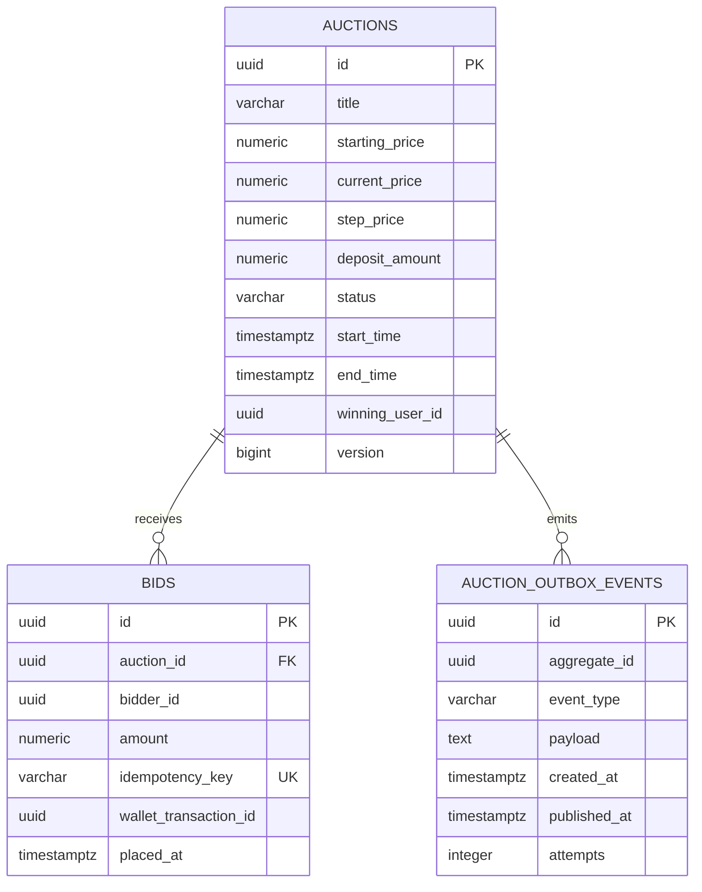
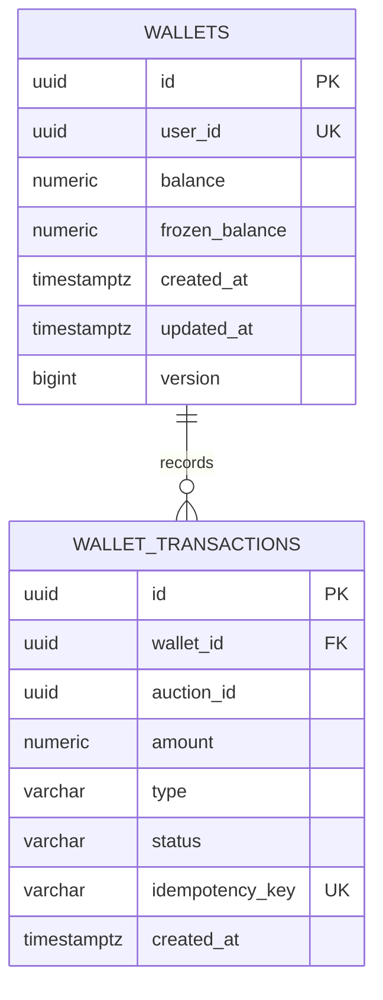

# OmniBid Database Schema

OmniBid dùng database-per-service về mặt ownership. Local Docker Compose dùng chung một PostgreSQL instance nhưng tạo ba database độc lập; audit log nằm ở MongoDB. Flyway migrations trong từng service là nguồn sự thật của schema.

## Data topology

| Store | Owner | Schema source |
|---|---|---|
| PostgreSQL `identity_db` | Identity service | `services/identity-service/src/main/resources/db/migration/` |
| PostgreSQL `auction_db` | Auction service | `services/auction-service/src/main/resources/db/migration/` |
| PostgreSQL `wallet_db` | Wallet service | `services/wallet-service/src/main/resources/db/migration/` |
| MongoDB `omnibid_audit` | Audit service | `BidAuditLog` mapping và Mongo index annotation |
| Redis | Auction/Wallet | lock, cache và short-lived idempotency keys; không phải source of truth |

`infrastructure/postgres/init.sql` chỉ tạo ba database khi volume PostgreSQL được khởi tạo lần đầu. Nó không sở hữu table schema.

## Identity database

```mermaid
erDiagram
    USERS ||--|| USER_PROFILES : has
    USERS ||--o{ USER_IDENTITIES : authenticates_with
    USERS ||--o{ AUTH_SESSIONS : owns
    USERS ||--o{ USER_ROLES : receives
    ROLES ||--o{ USER_ROLES : grants
    USERS ||--o{ AUTH_EVENTS : produces

    USERS {
      uuid id PK
      varchar primary_email UK
      varchar status
      timestamptz created_at
      timestamptz updated_at
      timestamptz last_login_at
      bigint version
    }
    USER_IDENTITIES {
      uuid id PK
      uuid user_id FK
      varchar provider
      varchar provider_subject UK
      varchar provider_email
      boolean email_verified
      timestamptz last_used_at
    }
    USER_PROFILES {
      uuid user_id PK_FK
      varchar display_name
      varchar avatar_url
      varchar phone_number
      varchar locale
      varchar timezone
      varchar bio
    }
    AUTH_SESSIONS {
      uuid id PK
      uuid user_id FK
      uuid token_family_id
      varchar refresh_token_hash UK
      varchar status
      timestamptz expires_at
      uuid replaced_by_session_id FK
    }
```

Các bảng khác:

- `roles`: role hệ thống `CUSTOMER`, `ADMIN`.
- `user_roles`: quan hệ many-to-many và thời điểm cấp quyền.
- `auth_events`: audit authentication outcome.
- `identity_outbox_events`: event được commit cùng account trước khi publish Kafka.

Invariant quan trọng:

- `lower(users.primary_email)` unique.
- Google identity unique theo `(provider, provider_subject)`; email không phải external identity key.
- Refresh token chỉ lưu SHA-256 hash; token plaintext chỉ đi qua HttpOnly cookie.
- Customer tự đăng ký luôn nhận `CUSTOMER`; client không được chỉ định role.
- Account bootstrap từ `OMNIBID_ADMIN_EMAIL` nhận `ADMIN` và vẫn được lưu trong `users`/`user_roles`.

## Auction database



`version` hỗ trợ optimistic locking. Redis `lock:auction:{id}` serialize concurrent writers, nhưng PostgreSQL transaction, version và unique idempotency key vẫn là durable safety net.

## Wallet database



Invariant số dư:

```text
available_balance = balance - frozen_balance
balance >= 0
0 <= frozen_balance <= balance
transaction.amount > 0
```

Các transaction type hiện có: `FREEZE`, `REFUND`, `DEDUCT`, `TOP_UP`, `WITHDRAW`. PostgreSQL unique idempotency key là lớp chống duplicate bền vững; Redis chỉ là fast dedupe.

## Audit MongoDB

Collection `bid_logs`:

| Field | Type | Ý nghĩa |
|---|---|---|
| `_id` | String UUID | dùng `bidId`, giúp Kafka redelivery idempotent |
| `auctionId` | UUID | auction aggregate |
| `userId` | UUID | bidder external reference |
| `bidAmount` | Decimal | số tiền bid |
| `timestamp` | Instant | thời điểm bid |

Compound index: `{ auctionId: 1, timestamp: -1 }` để đọc lịch sử mới nhất của một phiên.

## Migration rules

1. Không dùng `ddl-auto=update`; Hibernate chỉ `validate` mapping.
2. Thay đổi schema phải thêm Flyway migration mới, không sửa migration đã chạy.
3. Không tạo foreign key xuyên service/database.
4. Không lưu secret, raw refresh token hoặc Google credential trong database.
5. Trước thay đổi destructive cần backup và migration plan; local reset volume chỉ dùng khi chấp nhận mất dữ liệu.

## Xem schema local

```powershell
docker compose exec postgres psql -U omnibid -d identity_db -c "\dt"
docker compose exec postgres psql -U omnibid -d auction_db -c "\dt"
docker compose exec postgres psql -U omnibid -d wallet_db -c "\dt"
docker compose exec mongodb mongosh omnibid_audit --eval "db.bid_logs.getIndexes()"
```
