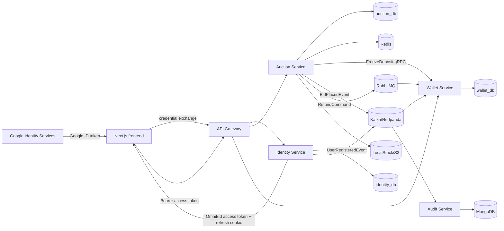
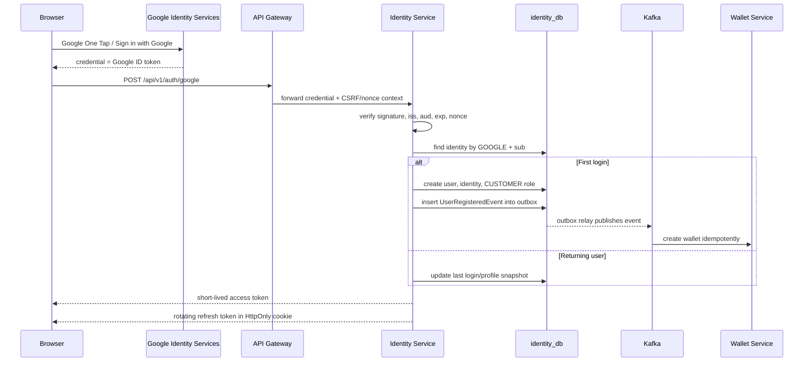
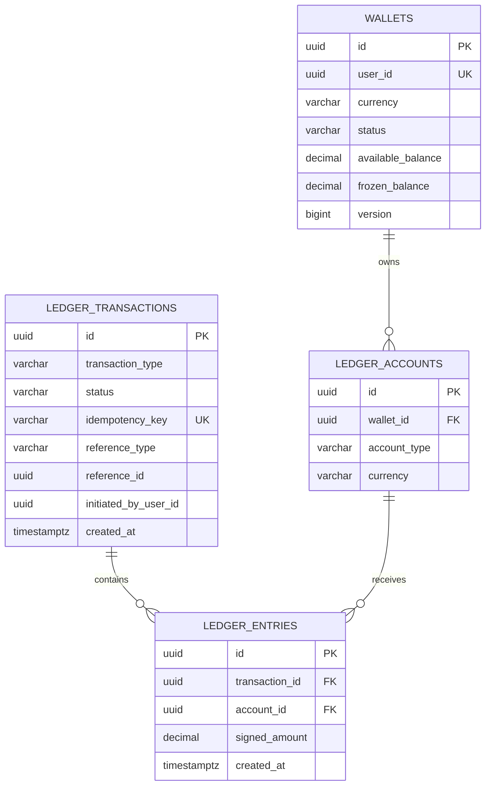

# PHASE 4 — Identity, Authorization & Marketplace Domain Design

## 1. Mục tiêu

Phase 4 nâng OmniBid từ một distributed auction lab thành một marketplace demo có người dùng thật:

- Đăng nhập/đăng ký bằng Google One Tap.
- Mỗi người có tài khoản, hồ sơ, ví và lịch sử riêng.
- Phân quyền `ADMIN` và `CUSTOMER`.
- Admin quản lý sản phẩm và vòng đời phiên đấu giá.
- Customer nạp/rút tiền demo, đặt giá, xem lịch sử tham gia/thắng/thua.
- Không nhận `userId` từ request body của client; danh tính luôn lấy từ access token đã xác minh.
- Có thể chạy nhiều browser profile hoặc load test nhiều user đồng thời.
- Giữ đúng service boundary và không tạo foreign key xuyên database.

Phase này vẫn dùng tiền demo nội bộ, không tích hợp ngân hàng/payment gateway.

## 2. Quyết định kiến trúc

### Thêm hai application service

1. `identity-service`
   - Google One Tap token verification.
   - Quản lý user, external identity, profile, role và login session.
   - Phát hành access token nội bộ cho OmniBid.
   - Publish `UserRegisteredEvent` bằng transactional outbox.

2. `api-gateway`
   - External ingress duy nhất cho frontend.
   - Route request tới identity, auction và wallet service.
   - Rate limiting, correlation ID và coarse-grained authentication.
   - Resource service vẫn tự validate token và tự authorize nghiệp vụ.

Không tạo riêng `product-service` trong phase này. Product và Auction có cùng lifecycle quản trị, cùng use case admin và cùng transaction boundary, nên đặt trong `auction-service` giúp hệ thống đủ chi tiết mà chưa bị microservice hóa quá mức.

### Kiến trúc mục tiêu



## 3. Luồng Google One Tap



### Security rules bắt buộc

- Frontend gửi Google credential tới backend; frontend không tự coi decode JWT là đăng nhập thành công.
- Identity service xác minh chữ ký Google và các claim `iss`, `aud`, `exp`; nếu dùng nonce thì phải so khớp nonce.
- Dùng `(provider, provider_subject)` làm định danh external duy nhất. Với Google, `provider_subject` lấy từ claim `sub`.
- Không dùng email làm primary identity vì email có thể thay đổi.
- Không tự động link một Google identity mới vào user cũ chỉ vì email giống nhau. Account linking phải được user đang đăng nhập xác nhận.
- Không lấy role từ Google token. Role chỉ được đọc từ `identity_db`.
- Google ID token chỉ được identity-service chấp nhận tại login endpoint; auction/wallet service không nhận trực tiếp token Google.
- Access token OmniBid sống ngắn, đề xuất 5–10 phút.
- Refresh token sống dài hơn, lưu ở cookie `HttpOnly`, `Secure`, `SameSite=Lax`; database chỉ lưu hash của token.
- Refresh token được rotate mỗi lần refresh; nếu token cũ bị dùng lại thì revoke cả token family.
- Frontend giữ access token trong memory, không lưu access/refresh token vào `localStorage`.
- Login, refresh, logout, bid, top-up và withdraw phải có rate limit.
- Production bắt buộc HTTPS.

## 4. Identity database

Database mới: `identity_db`.

### ERD

```mermaid
erDiagram
    USERS ||--|| USER_PROFILES : has
    USERS ||--o{ USER_IDENTITIES : authenticates_with
    USERS ||--o{ USER_ROLES : receives
    ROLES ||--o{ USER_ROLES : grants
    USERS ||--o{ AUTH_SESSIONS : owns
    USERS ||--o{ AUTH_EVENTS : generates
    USERS ||--o{ OUTBOX_EVENTS : causes

    USERS {
        uuid id PK
        varchar primary_email
        varchar status
        timestamptz created_at
        timestamptz updated_at
        timestamptz last_login_at
        bigint version
    }

    USER_IDENTITIES {
        uuid id PK
        uuid user_id FK
        varchar provider
        varchar provider_subject
        varchar provider_email
        boolean email_verified
        timestamptz created_at
        timestamptz last_used_at
    }

    USER_PROFILES {
        uuid user_id PK_FK
        varchar display_name
        varchar avatar_url
        varchar phone_number
        varchar locale
        varchar timezone
        text bio
    }

    ROLES {
        smallint id PK
        varchar code UK
    }

    USER_ROLES {
        uuid user_id FK
        smallint role_id FK
        uuid granted_by_user_id
        timestamptz granted_at
    }

    AUTH_SESSIONS {
        uuid id PK
        uuid user_id FK
        uuid token_family_id
        char refresh_token_hash UK
        varchar status
        timestamptz expires_at
        timestamptz last_used_at
        timestamptz revoked_at
    }

    AUTH_EVENTS {
        uuid id PK
        uuid user_id FK
        varchar event_type
        varchar result
        varchar ip_hash
        timestamptz occurred_at
    }

    OUTBOX_EVENTS {
        uuid id PK
        varchar aggregate_type
        uuid aggregate_id
        varchar event_type
        jsonb payload
        timestamptz created_at
        timestamptz published_at
    }
```

### PostgreSQL schema đề xuất

```sql
CREATE TABLE users (
    id UUID PRIMARY KEY,
    primary_email VARCHAR(320) NOT NULL,
    status VARCHAR(20) NOT NULL
        CHECK (status IN ('ACTIVE', 'BLOCKED', 'DELETED')),
    created_at TIMESTAMPTZ NOT NULL DEFAULT now(),
    updated_at TIMESTAMPTZ NOT NULL DEFAULT now(),
    last_login_at TIMESTAMPTZ,
    version BIGINT NOT NULL DEFAULT 0
);

CREATE UNIQUE INDEX uk_users_primary_email_ci
    ON users (lower(primary_email));

CREATE TABLE user_identities (
    id UUID PRIMARY KEY,
    user_id UUID NOT NULL REFERENCES users(id),
    provider VARCHAR(30) NOT NULL
        CHECK (provider IN ('GOOGLE')),
    provider_subject VARCHAR(255) NOT NULL,
    provider_email VARCHAR(320),
    email_verified BOOLEAN NOT NULL DEFAULT FALSE,
    created_at TIMESTAMPTZ NOT NULL DEFAULT now(),
    last_used_at TIMESTAMPTZ NOT NULL DEFAULT now(),
    CONSTRAINT uk_user_identity_provider_subject
        UNIQUE (provider, provider_subject)
);

CREATE TABLE user_profiles (
    user_id UUID PRIMARY KEY REFERENCES users(id),
    display_name VARCHAR(120) NOT NULL,
    avatar_url VARCHAR(1000),
    phone_number VARCHAR(30),
    locale VARCHAR(20) NOT NULL DEFAULT 'vi-VN',
    timezone VARCHAR(50) NOT NULL DEFAULT 'Asia/Ho_Chi_Minh',
    bio VARCHAR(500),
    updated_at TIMESTAMPTZ NOT NULL DEFAULT now()
);

CREATE TABLE roles (
    id SMALLSERIAL PRIMARY KEY,
    code VARCHAR(30) NOT NULL UNIQUE
        CHECK (code IN ('CUSTOMER', 'ADMIN'))
);

CREATE TABLE user_roles (
    user_id UUID NOT NULL REFERENCES users(id),
    role_id SMALLINT NOT NULL REFERENCES roles(id),
    granted_by_user_id UUID REFERENCES users(id),
    granted_at TIMESTAMPTZ NOT NULL DEFAULT now(),
    PRIMARY KEY (user_id, role_id)
);

CREATE TABLE auth_sessions (
    id UUID PRIMARY KEY,
    user_id UUID NOT NULL REFERENCES users(id),
    token_family_id UUID NOT NULL,
    refresh_token_hash CHAR(64) NOT NULL UNIQUE,
    user_agent VARCHAR(500),
    ip_hash CHAR(64),
    status VARCHAR(20) NOT NULL
        CHECK (status IN ('ACTIVE', 'ROTATED', 'REVOKED', 'EXPIRED')),
    created_at TIMESTAMPTZ NOT NULL DEFAULT now(),
    expires_at TIMESTAMPTZ NOT NULL,
    last_used_at TIMESTAMPTZ,
    revoked_at TIMESTAMPTZ,
    replaced_by_session_id UUID REFERENCES auth_sessions(id)
);

CREATE INDEX idx_auth_sessions_user_status
    ON auth_sessions (user_id, status);

CREATE INDEX idx_auth_sessions_family
    ON auth_sessions (token_family_id);

CREATE TABLE auth_events (
    id UUID PRIMARY KEY,
    user_id UUID REFERENCES users(id),
    event_type VARCHAR(50) NOT NULL,
    result VARCHAR(20) NOT NULL,
    ip_hash CHAR(64),
    user_agent VARCHAR(500),
    occurred_at TIMESTAMPTZ NOT NULL DEFAULT now()
);

CREATE TABLE identity_outbox_events (
    id UUID PRIMARY KEY,
    aggregate_type VARCHAR(100) NOT NULL,
    aggregate_id UUID NOT NULL,
    event_type VARCHAR(150) NOT NULL,
    payload JSONB NOT NULL,
    created_at TIMESTAMPTZ NOT NULL DEFAULT now(),
    published_at TIMESTAMPTZ
);

CREATE INDEX idx_identity_outbox_unpublished
    ON identity_outbox_events (created_at)
    WHERE published_at IS NULL;
```

### Seed role

```sql
INSERT INTO roles(code) VALUES ('CUSTOMER'), ('ADMIN');
```

User đăng nhập lần đầu luôn nhận `CUSTOMER`. Admin đầu tiên được bootstrap bằng migration/config deploy có audit, không có API public để tự nâng mình thành admin.

## 5. Product và Auction database

Product thuộc `auction-service`. Các UUID user ở database này là external reference; không có foreign key sang `identity_db`.

### ERD

```mermaid
erDiagram
    CATEGORIES ||--o{ PRODUCTS : contains
    PRODUCTS ||--o{ PRODUCT_IMAGES : has
    PRODUCTS ||--o{ AUCTIONS : listed_as
    AUCTIONS ||--o{ BIDS : receives
    AUCTIONS ||--o{ AUCTION_DEPOSITS : requires
    AUCTIONS ||--o| AUCTION_RESULTS : produces
    AUCTIONS ||--o{ WATCHLIST_ITEMS : watched_by

    PRODUCTS {
        uuid id PK
        varchar title
        text description
        varchar condition
        varchar status
        uuid category_id FK
        uuid created_by_user_id
        bigint version
    }

    AUCTIONS {
        uuid id PK
        uuid product_id FK
        decimal starting_price
        decimal current_price
        decimal step_price
        decimal deposit_amount
        varchar status
        uuid winning_user_id
        uuid created_by_user_id
        bigint version
    }

    BIDS {
        uuid id PK
        uuid auction_id FK
        uuid bidder_id
        decimal amount
        varchar idempotency_key UK
        uuid wallet_transaction_id
        timestamptz placed_at
    }

    AUCTION_DEPOSITS {
        uuid id PK
        uuid auction_id FK
        uuid user_id
        uuid freeze_transaction_id
        decimal amount
        varchar status
    }

    AUCTION_RESULTS {
        uuid auction_id PK_FK
        uuid winning_bid_id
        uuid winner_user_id
        decimal final_price
        varchar settlement_status
    }
```

### Bảng bổ sung

```sql
CREATE TABLE categories (
    id UUID PRIMARY KEY,
    name VARCHAR(120) NOT NULL,
    slug VARCHAR(140) NOT NULL UNIQUE,
    status VARCHAR(20) NOT NULL
        CHECK (status IN ('ACTIVE', 'INACTIVE')),
    created_at TIMESTAMPTZ NOT NULL DEFAULT now()
);

CREATE TABLE products (
    id UUID PRIMARY KEY,
    category_id UUID REFERENCES categories(id),
    title VARCHAR(200) NOT NULL,
    description TEXT NOT NULL,
    product_condition VARCHAR(30) NOT NULL
        CHECK (product_condition IN ('NEW', 'LIKE_NEW', 'USED', 'COLLECTIBLE')),
    status VARCHAR(20) NOT NULL
        CHECK (status IN ('DRAFT', 'READY', 'LISTED', 'SOLD', 'ARCHIVED')),
    created_by_user_id UUID NOT NULL,
    created_at TIMESTAMPTZ NOT NULL DEFAULT now(),
    updated_at TIMESTAMPTZ NOT NULL DEFAULT now(),
    version BIGINT NOT NULL DEFAULT 0
);

CREATE TABLE product_images (
    id UUID PRIMARY KEY,
    product_id UUID NOT NULL REFERENCES products(id),
    object_key VARCHAR(500) NOT NULL,
    content_type VARCHAR(100) NOT NULL,
    display_order INTEGER NOT NULL DEFAULT 0,
    is_primary BOOLEAN NOT NULL DEFAULT FALSE,
    created_at TIMESTAMPTZ NOT NULL DEFAULT now(),
    CONSTRAINT uk_product_image_order UNIQUE (product_id, display_order)
);

CREATE UNIQUE INDEX uk_product_primary_image
    ON product_images (product_id)
    WHERE is_primary = TRUE;

ALTER TABLE auctions ADD COLUMN product_id UUID REFERENCES products(id);
ALTER TABLE auctions ADD COLUMN created_by_user_id UUID;

CREATE TABLE auction_deposits (
    id UUID PRIMARY KEY,
    auction_id UUID NOT NULL REFERENCES auctions(id),
    user_id UUID NOT NULL,
    freeze_transaction_id UUID NOT NULL,
    amount NUMERIC(19,2) NOT NULL CHECK (amount > 0),
    status VARCHAR(20) NOT NULL
        CHECK (status IN ('FROZEN', 'REFUND_PENDING', 'REFUNDED', 'CAPTURED')),
    created_at TIMESTAMPTZ NOT NULL DEFAULT now(),
    updated_at TIMESTAMPTZ NOT NULL DEFAULT now(),
    CONSTRAINT uk_auction_deposit_user UNIQUE (auction_id, user_id),
    CONSTRAINT uk_auction_deposit_freeze_transaction UNIQUE (freeze_transaction_id)
);

CREATE TABLE auction_results (
    auction_id UUID PRIMARY KEY REFERENCES auctions(id),
    winning_bid_id UUID REFERENCES bids(id),
    winner_user_id UUID,
    final_price NUMERIC(19,2),
    settlement_status VARCHAR(30) NOT NULL
        CHECK (settlement_status IN ('NO_WINNER', 'PENDING', 'COMPLETED', 'FAILED')),
    finalized_at TIMESTAMPTZ NOT NULL
);

CREATE TABLE watchlist_items (
    user_id UUID NOT NULL,
    auction_id UUID NOT NULL REFERENCES auctions(id),
    created_at TIMESTAMPTZ NOT NULL DEFAULT now(),
    PRIMARY KEY (user_id, auction_id)
);

CREATE INDEX idx_bids_bidder_placed_at
    ON bids (bidder_id, placed_at DESC);

CREATE INDEX idx_auction_deposits_user_status
    ON auction_deposits (user_id, status);
```

### Auction lifecycle

```text
DRAFT -> SCHEDULED -> ACTIVE -> ENDED
                 \-> CANCELLED
```

- `DRAFT`: admin đang chuẩn bị sản phẩm/giá.
- `SCHEDULED`: đã publish nhưng chưa tới giờ bắt đầu.
- `ACTIVE`: customer được bid.
- `ENDED`: đã khóa kết quả, không nhận bid.
- `CANCELLED`: hoàn tất refund cho toàn bộ participant.

Không cho phép sửa giá, step hoặc deposit sau khi auction đã `ACTIVE`.

## 6. Wallet và zero-sum ledger

Top-up/withdraw demo không cần ngân hàng, nhưng vẫn phải tạo giao dịch có thể audit. Không nên chỉ cộng/trừ trực tiếp cột `balance` mà không có journal.

### Mô hình



Mỗi ledger transaction có tổng `signed_amount = 0`.

| Nghiệp vụ | Entry 1 | Entry 2 |
|---|---|---|
| Demo top-up 500.000 | `SYSTEM_DEMO = -500.000` | `USER_AVAILABLE = +500.000` |
| Withdraw 100.000 | `USER_AVAILABLE = -100.000` | `SYSTEM_DEMO = +100.000` |
| Freeze 100 | `USER_AVAILABLE = -100` | `USER_FROZEN = +100` |
| Refund 100 | `USER_FROZEN = -100` | `USER_AVAILABLE = +100` |
| Capture winner deposit | `USER_FROZEN = -100` | `PLATFORM_ESCROW = +100` |

`available_balance` và `frozen_balance` trên `wallets` là projection để đọc nhanh. Chúng được cập nhật trong cùng PostgreSQL transaction với ledger entries.

### Schema đề xuất

```sql
ALTER TABLE wallets ADD COLUMN currency CHAR(3) NOT NULL DEFAULT 'VND';
ALTER TABLE wallets ADD COLUMN status VARCHAR(20) NOT NULL DEFAULT 'ACTIVE';

CREATE TABLE ledger_accounts (
    id UUID PRIMARY KEY,
    wallet_id UUID REFERENCES wallets(id),
    owner_type VARCHAR(20) NOT NULL
        CHECK (owner_type IN ('USER', 'SYSTEM')),
    account_type VARCHAR(30) NOT NULL
        CHECK (account_type IN (
            'USER_AVAILABLE', 'USER_FROZEN',
            'SYSTEM_DEMO', 'PLATFORM_ESCROW', 'PLATFORM_REVENUE'
        )),
    currency CHAR(3) NOT NULL,
    created_at TIMESTAMPTZ NOT NULL DEFAULT now(),
    CONSTRAINT ck_ledger_account_owner CHECK (
        (owner_type = 'USER' AND wallet_id IS NOT NULL)
        OR (owner_type = 'SYSTEM' AND wallet_id IS NULL)
    )
);

CREATE UNIQUE INDEX uk_user_ledger_account
    ON ledger_accounts (wallet_id, account_type, currency)
    WHERE wallet_id IS NOT NULL;

CREATE UNIQUE INDEX uk_system_ledger_account
    ON ledger_accounts (account_type, currency)
    WHERE owner_type = 'SYSTEM';

CREATE TABLE ledger_transactions (
    id UUID PRIMARY KEY,
    transaction_type VARCHAR(30) NOT NULL
        CHECK (transaction_type IN (
            'TOP_UP', 'WITHDRAW', 'FREEZE', 'REFUND', 'CAPTURE', 'SETTLEMENT'
        )),
    status VARCHAR(20) NOT NULL
        CHECK (status IN ('PENDING', 'COMPLETED', 'FAILED', 'REVERSED')),
    idempotency_key VARCHAR(120) NOT NULL UNIQUE,
    reference_type VARCHAR(50),
    reference_id UUID,
    initiated_by_user_id UUID,
    failure_reason VARCHAR(500),
    created_at TIMESTAMPTZ NOT NULL DEFAULT now(),
    completed_at TIMESTAMPTZ
);

CREATE TABLE ledger_entries (
    id UUID PRIMARY KEY,
    transaction_id UUID NOT NULL REFERENCES ledger_transactions(id),
    account_id UUID NOT NULL REFERENCES ledger_accounts(id),
    signed_amount NUMERIC(19,2) NOT NULL CHECK (signed_amount <> 0),
    currency CHAR(3) NOT NULL,
    created_at TIMESTAMPTZ NOT NULL DEFAULT now()
);

CREATE INDEX idx_ledger_entries_account_created
    ON ledger_entries (account_id, created_at DESC);

CREATE INDEX idx_ledger_transactions_reference
    ON ledger_transactions (reference_type, reference_id);
```

Database constraint không dễ tự kiểm tra tổng nhiều row bằng `CHECK`; service phải insert entries trong một transaction và verify tổng bằng 0 trước khi commit. Integration test phải chứng minh invariant này.

## 7. RBAC và ownership

### Permission matrix

| Chức năng | Public | CUSTOMER | ADMIN |
|---|:---:|:---:|:---:|
| Xem auction đang publish | ✓ | ✓ | ✓ |
| Xem bid history đã ẩn danh | ✓ | ✓ | ✓ |
| Đăng nhập Google | ✓ | — | — |
| Xem/sửa profile bản thân | — | ✓ | ✓ |
| Xem ví và ledger của bản thân | — | ✓ | ✓ |
| Top-up/withdraw demo cho bản thân | — | ✓ | ✓ |
| Bid bằng tài khoản bản thân | — | ✓ | ✓ |
| Xem auction đã tham gia/thắng/thua | — | ✓ | ✓ |
| Quản lý watchlist | — | ✓ | ✓ |
| CRUD category/product | — | — | ✓ |
| Upload ảnh sản phẩm | — | — | ✓ |
| Tạo/schedule/start/end/cancel auction | — | — | ✓ |
| Xem toàn bộ user/audit vận hành | — | — | ✓ |
| Cấp role ADMIN | — | — | Admin được ủy quyền/bootstrap |

### Ownership rules

- Customer không truyền `userId` trong bid/top-up/withdraw request.
- Controller lấy local user ID từ authenticated principal: `jwt.getSubject()`.
- URL `/users/{id}` không cho customer đọc user khác; ưu tiên `/me`.
- Admin có thể xem wallet phục vụ support nhưng không được trực tiếp sửa balance bằng CRUD.
- Mọi thay đổi tiền phải đi qua wallet command và ledger.
- Admin endpoint dùng cả role check và domain validation, ví dụ `@PreAuthorize("hasRole('ADMIN')")`.
- Resource service phải kiểm tra `users.status` gián tiếp qua token/session policy hoặc consume `UserBlockedEvent`; không dựa duy nhất vào gateway.

## 8. API design

### Identity

```http
POST   /api/v1/auth/google
POST   /api/v1/auth/refresh
POST   /api/v1/auth/logout
POST   /api/v1/auth/logout-all
GET    /api/v1/me
PATCH  /api/v1/me/profile
GET    /api/v1/me/sessions
DELETE /api/v1/me/sessions/{sessionId}
```

Google login request:

```json
{
  "credential": "<GOOGLE_ID_TOKEN>",
  "nonce": "<ONE_TIME_NONCE>"
}
```

Response không trả refresh token trong JSON:

```json
{
  "accessToken": "<SHORT_LIVED_OMNIBID_JWT>",
  "expiresIn": 600,
  "user": {
    "id": "uuid",
    "email": "user@example.com",
    "displayName": "User",
    "avatarUrl": "https://...",
    "roles": ["CUSTOMER"]
  }
}
```

### Customer auction

```http
GET  /api/v1/auctions
GET  /api/v1/auctions/{auctionId}
GET  /api/v1/auctions/{auctionId}/bids
POST /api/v1/auctions/{auctionId}/bids
GET  /api/v1/me/auctions?result=ALL|WIN|LOSE|ACTIVE
GET  /api/v1/me/bids?page=0&size=20
POST /api/v1/me/watchlist/{auctionId}
DELETE /api/v1/me/watchlist/{auctionId}
```

Bid request mới:

```json
{
  "bidAmount": 1500000
}
```

`userId` bị loại khỏi body và lấy từ authenticated principal.

### Wallet

```http
GET  /api/v1/me/wallet
GET  /api/v1/me/wallet/transactions?page=0&size=20
POST /api/v1/me/wallet/top-ups
POST /api/v1/me/wallet/withdrawals
```

Top-up/withdraw đều yêu cầu `X-Idempotency-Key` và giới hạn demo, ví dụ:

```text
minimum = 10.000 VND
maximum per operation = 10.000.000 VND
maximum daily demo top-up = 50.000.000 VND
```

### Admin

```http
POST   /api/v1/admin/categories
PATCH  /api/v1/admin/categories/{id}

POST   /api/v1/admin/products
GET    /api/v1/admin/products
GET    /api/v1/admin/products/{id}
PATCH  /api/v1/admin/products/{id}
POST   /api/v1/admin/products/{id}/images/presign
DELETE /api/v1/admin/products/{id}/images/{imageId}

POST   /api/v1/admin/auctions
PATCH  /api/v1/admin/auctions/{id}
POST   /api/v1/admin/auctions/{id}/schedule
POST   /api/v1/admin/auctions/{id}/start
POST   /api/v1/admin/auctions/{id}/end
POST   /api/v1/admin/auctions/{id}/cancel

GET    /api/v1/admin/users
PATCH  /api/v1/admin/users/{id}/status
```

## 9. Access token nội bộ

Ví dụ claims:

```json
{
  "iss": "https://identity.omnibid.local",
  "sub": "<LOCAL_USER_UUID>",
  "aud": ["omnibid-api"],
  "roles": ["CUSTOMER"],
  "sid": "<AUTH_SESSION_ID>",
  "iat": 1787000000,
  "exp": 1787000600,
  "jti": "<TOKEN_ID>"
}
```

- `sub` luôn là local `users.id`, không phải Google `sub`.
- Ký token bằng asymmetric key, đề xuất RSA-2048 hoặc EC P-256.
- Identity service giữ private key; các resource service chỉ cần public JWK set.
- Mỗi resource service validate signature, `iss`, `aud`, `exp` và role.
- Hỗ trợ key rotation bằng `kid`.

## 10. Domain events

### Identity events

```text
UserRegisteredEvent
UserProfileUpdatedEvent
UserBlockedEvent
UserUnblockedEvent
```

`UserRegisteredEvent` tối thiểu:

```json
{
  "eventId": "uuid",
  "eventType": "UserRegistered",
  "schemaVersion": 1,
  "userId": "uuid",
  "occurredAt": "2026-08-19T00:00:00Z"
}
```

Wallet consumer tạo wallet và ledger accounts idempotently bằng `eventId` hoặc unique `user_id`. Email/profile là PII thuộc identity-service và không được đưa vào event khi consumer không cần dùng.

### Auction/wallet events bổ sung

```text
AuctionCreatedEvent
AuctionStartedEvent
BidPlacedEvent
AuctionEndedEvent
DepositFrozenEvent
RefundRequestedEvent
RefundCompletedEvent
WithdrawalCompletedEvent
```

Các event quan trọng phải được publish qua transactional outbox thay vì gọi broker trực tiếp sau database commit.

## 11. Mô phỏng nhiều người đấu giá

### Manual demo

- Tạo ít nhất ba Google account test.
- Mở Chrome/Edge bằng ba browser profile hoặc hai browser + incognito.
- Mỗi profile đăng nhập một Google account qua One Tap.
- Các profile cùng mở một auction và bid gần đồng thời.
- UI phải hiển thị anonymous bidder, không lộ email/name.

### Local development với danh tính thật

Local dùng OAuth Web Client riêng và Google test users. Không có `dev-auth`, token cố định hoặc account alias trong source. Customer mới được tạo qua cùng luồng production; admin được provision từ `OMNIBID_ADMIN_EMAIL` rồi claim bằng Google credential đã verify.

Khi cần automated test, Spring Security test fixtures ký JWT ngắn hạn trong test scope. Không mở backdoor HTTP chỉ để phục vụ Postman hoặc load test.

### Automated concurrency test

Dùng k6 hoặc Gatling:

1. Tạo 50–1.000 local test users.
2. Mỗi virtual user có access token riêng.
3. Tất cả bid vào cùng auction trong một cửa sổ thời gian ngắn.
4. Mỗi request có idempotency key riêng; một tỷ lệ request được retry cùng key.
5. Sau test, assert:
   - Giá tăng đúng theo rule.
   - Không có hai winning bid tại cùng version.
   - Mỗi user chỉ có một deposit freeze cho auction.
   - Duplicate request trả cùng bid result.
   - Số audit log bằng số unique bid.
   - Tổng ledger entries của mỗi transaction bằng 0.

Đây là phần rất giá trị khi mô tả trong CV vì nó chứng minh concurrency bằng số liệu thay vì chỉ trình bày code lock.

## 12. Frontend screens

### Public

- Landing page.
- Auction catalog, search/filter/category.
- Auction detail và anonymous bid history.
- Google One Tap / Sign in with Google button.

### Customer

- `/profile`: avatar, display name, locale, session management.
- `/wallet`: available/frozen balance.
- `/wallet/history`: top-up, withdraw, freeze, refund, settlement.
- `/my-auctions`: active, won, lost.
- `/my-bids`: paginated bid history.
- `/watchlist`.
- Auction detail: authenticated bid form.

### Admin

- `/admin/dashboard`: auction/user/volume summary.
- `/admin/products`: CRUD product, images, category.
- `/admin/auctions`: draft/schedule/start/end/cancel.
- `/admin/users`: view and block/unblock.
- `/admin/audit`: operational audit trail.

Frontend không render admin navigation chỉ dựa trên local state; backend vẫn phải enforce role cho mọi admin API.

## 13. Migration từ project hiện tại

1. Tạo Maven module `services/identity-service` và database `identity_db`.
2. Thêm Flyway migration cho identity schema và role seed.
3. Bọc `DemoDataConfig` hiện tại bằng profile `local`.
4. Khi user đăng ký, publish `UserRegisteredEvent`; wallet-service tạo wallet.
5. Thêm Spring Security Resource Server vào auction/wallet service.
6. Đổi `PlaceBidRequest(userId, bidAmount)` thành `PlaceBidRequest(bidAmount)`.
7. Lấy user từ JWT principal trong controller/service boundary.
8. Thêm method security cho admin endpoint.
9. Bổ sung Product, Category, Image, AuctionDeposit và AuctionResult.
10. Chuyển wallet sang ledger dần; giữ balance hiện tại làm projection trong giai đoạn migration.
11. Thêm API Gateway và chuyển frontend base URL về một origin.
12. Thêm transactional outbox trước khi mở rộng thêm event.

Không tạo foreign key từ `wallets.user_id`, `bids.bidder_id` hoặc `products.created_by_user_id` sang `identity_db`. Consistency xuyên service được xử lý bằng event, idempotency và reconciliation.

## 14. Kế hoạch triển khai theo milestone

### Milestone 4.1 — Identity foundation

- Identity schema + Flyway.
- Google One Tap backend verification.
- User/profile/role/session.
- Access token + refresh rotation.
- `/me` API.
- Unit/integration/security tests.

### Milestone 4.2 — Resource authorization

- Spring Security ở auction/wallet.
- Bỏ `userId` khỏi public body.
- Ownership checks.
- Admin role và admin bootstrap.
- API Gateway + CORS/correlation/rate limit.

### Milestone 4.3 — Product/admin domain

- Category/product/image schema.
- S3/LocalStack presigned upload.
- Auction lifecycle cho admin.
- Admin dashboard UI.

### Milestone 4.4 — Wallet ledger

- Ledger account/transaction/entry.
- Top-up/withdraw demo.
- Freeze/refund/capture bằng zero-sum entries.
- Wallet history và reconciliation job.

### Milestone 4.5 — Customer history & multi-user test

- My auctions/bids/wallet history/profile/watchlist.
- Local dev auth profile.
- k6/Gatling concurrent bidding scenario.
- Failure injection và redelivery test.

### Milestone 4.6 — Reliability

- Transactional outbox.
- Saga/compensation cho freeze-bid flow.
- OpenTelemetry trace.
- Prometheus/Grafana.
- CI pipeline và Docker application profile.

## 15. Definition of Done

Phase 4 được xem là hoàn thành khi:

- Google One Tap tạo/đăng nhập đúng một local user theo Google `sub`.
- Customer không thể giả `userId` của người khác.
- Customer không thể gọi admin API.
- Admin quản lý được product và auction lifecycle.
- UserRegistered event tạo wallet đúng một lần.
- Top-up/withdraw/freeze/refund có ledger history và idempotency.
- Customer xem được profile, wallet history, bid history và auction result của riêng mình.
- Ít nhất 100 virtual users bid đồng thời mà không phá invariant.
- Duplicate HTTP/Kafka/Rabbit messages không tạo giao dịch trùng.
- Security/integration tests chạy trong CI.

## 16. Tài liệu tham khảo chính thức

- Google — Verify the Google ID token on your server side: <https://developers.google.com/identity/gsi/web/guides/verify-google-id-token>
- Google — Sign in with Google JavaScript API: <https://developers.google.com/identity/gsi/web/reference/js-reference>
- Google — One Tap integration considerations: <https://developers.google.com/identity/gsi/web/guides/integrate>
- Spring Security — OAuth 2.0 Resource Server JWT: <https://docs.spring.io/spring-security/reference/servlet/oauth2/resource-server/jwt.html>
- RFC 9700 — OAuth 2.0 Security Best Current Practice: <https://www.rfc-editor.org/rfc/rfc9700>
